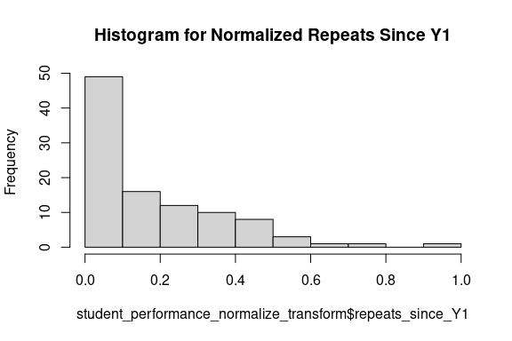

Business Intelligence Project
================
<Specify your name here>
<Specify the date when you submitted the lab>

- [Student Details](#student-details)
- [Setup Chunk](#setup-chunk)
- [STEP 1. Install and Load the Required
  Packages](#step-1-install-and-load-the-required-packages)
- [STEP 2. Load the Dataset](#step-2-load-the-dataset)
- [STEP 3. Apply a Scale Data
  Transform](#step-3-apply-a-scale-data-transform)
- [STEP 4. Apply a Centre Data
  Transform](#step-4-apply-a-centre-data-transform)
- [STEP 5. Apply a Standardize Data
  Transform](#step-5-apply-a-standardize-data-transform)
- [STEP 6. Apply a Normalize Data
  Transform](#step-6-apply-a-normalize-data-transform)
- [STEP 7. Apply a Box-Cox Power
  Transform](#step-7-apply-a-box-cox-power-transform)
- [STEP 8. Apply a Yeo-Johnson Power
  Transform](#step-8-apply-a-yeo-johnson-power-transform)
- [STEP 9.a. PCA Linear Algebra Transform for Dimensionality
  Reduction](#step-9a-pca-linear-algebra-transform-for-dimensionality-reduction)
- [STEP 9.b. PCA Linear Algebra Transform for Feature
  Extraction](#step-9b-pca-linear-algebra-transform-for-feature-extraction)
- [STEP 10. ICA Linear Algebra Transform for Dimensionality
  Reduction](#step-10-ica-linear-algebra-transform-for-dimensionality-reduction)

# Student Details

|                                              |                                              |
|----------------------------------------------|----------------------------------------------|
| **Student ID Number**                        | 112827,132234,134265                         |
| **Student Name**                             | Kenneth Mungai,Kelly Noella, Emmanuel Kiptoo |
| **BBIT 4.2 Group**                           | A,B                                          |
| **BI Project Group Name/ID (if applicable)** | Lumin                                        |

# Setup Chunk

**Note:** the following KnitR options have been set as the global
defaults: <BR>
`knitr::opts_chunk$set(echo = TRUE, warning = FALSE, eval = TRUE, collapse = FALSE, tidy = TRUE)`.

More KnitR options are documented here
<https://bookdown.org/yihui/rmarkdown-cookbook/chunk-options.html> and
here <https://yihui.org/knitr/options/>.

# STEP 1. Install and Load the Required Packages

``` r
## mlbench ----
if (require("mlbench")) {
  require("mlbench")
} else {
  install.packages("mlbench", dependencies = TRUE,
                   repos = "https://cloud.r-project.org")
}
```

    ## Loading required package: mlbench

``` r
## readr ----
if (require("readr")) {
  require("readr")
} else {
  install.packages("readr", dependencies = TRUE,
                   repos = "https://cloud.r-project.org")
}
```

    ## Loading required package: readr

``` r
## caret ----
if (require("caret")) {
  require("caret")
} else {
  install.packages("caret", dependencies = TRUE,
                   repos = "https://cloud.r-project.org")
}
```

    ## Loading required package: caret

    ## Loading required package: ggplot2

    ## Loading required package: lattice

``` r
## e1071 ----
if (require("e1071")) {
  require("e1071")
} else {
  install.packages("e1071", dependencies = TRUE,
                   repos = "https://cloud.r-project.org")
}
```

    ## Loading required package: e1071

``` r
## factoextra ----
if (require("factoextra")) {
  require("factoextra")
} else {
  install.packages("factoextra", dependencies = TRUE,
                   repos = "https://cloud.r-project.org")
}
```

    ## Loading required package: factoextra

    ## Welcome! Want to learn more? See two factoextra-related books at https://goo.gl/ve3WBa

``` r
## FactoMineR ----
if (require("FactoMineR")) {
  require("FactoMineR")
} else {
  install.packages("FactoMineR", dependencies = TRUE,
                   repos = "https://cloud.r-project.org")
}
```

    ## Loading required package: FactoMineR

``` r
library(readr)
```

# STEP 2. Load the Dataset

``` r
StudentPerformanceDataset <- read_csv("/home/ki3ani/BBT4206-R-Lab4of15-DataTransforms-lumin/data/perfomance-dataset.csv")
```

    ## Rows: 101 Columns: 100
    ## ── Column specification ────────────────────────────────────────────────────────
    ## Delimiter: ","
    ## chr  (4): class_group, D - 1. 
    ## Write two things you like about the teaching ...
    ## dbl (96): gender, YOB, regret_choosing_bi, drop_bi_now, motivator, read_cont...
    ## 
    ## ℹ Use `spec()` to retrieve the full column specification for this data.
    ## ℹ Specify the column types or set `show_col_types = FALSE` to quiet this message.

``` r
library(readr)
```

# STEP 3. Apply a Scale Data Transform

``` r
# Load the caret package if not already loaded
if (!requireNamespace("caret", quietly = TRUE)) {
  install.packages("caret")
}
library(caret)

# BEFORE
summary(StudentPerformanceDataset)
```

    ##  class_group            gender            YOB       regret_choosing_bi
    ##  Length:101         Min.   :0.0000   Min.   :1998   Min.   :0.0000    
    ##  Class :character   1st Qu.:0.0000   1st Qu.:2000   1st Qu.:0.0000    
    ##  Mode  :character   Median :1.0000   Median :2001   Median :0.0000    
    ##                     Mean   :0.5743   Mean   :2001   Mean   :0.0198    
    ##                     3rd Qu.:1.0000   3rd Qu.:2002   3rd Qu.:0.0000    
    ##                     Max.   :1.0000   Max.   :2003   Max.   :1.0000    
    ##                                                                       
    ##   drop_bi_now       motivator      read_content_before_lecture
    ##  Min.   :0.0000   Min.   :0.0000   Min.   :1.000              
    ##  1st Qu.:0.0000   1st Qu.:1.0000   1st Qu.:2.000              
    ##  Median :0.0000   Median :1.0000   Median :3.000              
    ##  Mean   :0.0198   Mean   :0.7525   Mean   :2.752              
    ##  3rd Qu.:0.0000   3rd Qu.:1.0000   3rd Qu.:3.000              
    ##  Max.   :1.0000   Max.   :1.0000   Max.   :5.000              
    ##                                                               
    ##  anticipate_test_questions answer_rhetorical_questions find_terms_I_do_not_know
    ##  Min.   :1.000             Min.   :1.000               Min.   :1.000           
    ##  1st Qu.:3.000             1st Qu.:3.000               1st Qu.:3.000           
    ##  Median :4.000             Median :4.000               Median :4.000           
    ##  Mean   :3.584             Mean   :3.426               Mean   :3.743           
    ##  3rd Qu.:4.000             3rd Qu.:4.000               3rd Qu.:5.000           
    ##  Max.   :5.000             Max.   :5.000               Max.   :5.000           
    ##                                                                                
    ##  copy_new_terms_in_reading_notebook take_quizzes_and_use_results
    ##  Min.   :1.000                      Min.   :1.000               
    ##  1st Qu.:3.000                      1st Qu.:3.000               
    ##  Median :4.000                      Median :4.000               
    ##  Mean   :3.663                      Mean   :3.941               
    ##  3rd Qu.:4.000                      3rd Qu.:5.000               
    ##  Max.   :5.000                      Max.   :5.000               
    ##                                                                 
    ##  reorganise_course_outline write_down_important_points space_out_revision
    ##  Min.   :1.000             Min.   :1.000               Min.   :1.000     
    ##  1st Qu.:3.000             1st Qu.:3.000               1st Qu.:3.000     
    ##  Median :3.000             Median :4.000               Median :3.000     
    ##  Mean   :3.376             Mean   :3.832               Mean   :3.228     
    ##  3rd Qu.:4.000             3rd Qu.:5.000               3rd Qu.:4.000     
    ##  Max.   :5.000             Max.   :5.000               Max.   :5.000     
    ##                                                                          
    ##  studying_in_study_group schedule_appointments goal_oriented  
    ##  Min.   :1.000           Min.   :1.000         Min.   :0.000  
    ##  1st Qu.:1.000           1st Qu.:1.000         1st Qu.:0.000  
    ##  Median :2.000           Median :2.000         Median :0.000  
    ##  Mean   :2.455           Mean   :1.931         Mean   :0.198  
    ##  3rd Qu.:3.000           3rd Qu.:2.000         3rd Qu.:0.000  
    ##  Max.   :5.000           Max.   :5.000         Max.   :1.000  
    ##                                                               
    ##  spaced_repetition testing_and_active_recall  interleaving    categorizing  
    ##  Min.   :1.000     Min.   :1.000             Min.   :1.000   Min.   :1.000  
    ##  1st Qu.:2.000     1st Qu.:3.000             1st Qu.:2.000   1st Qu.:2.000  
    ##  Median :3.000     Median :3.000             Median :2.000   Median :3.000  
    ##  Mean   :2.554     Mean   :3.059             Mean   :2.257   Mean   :2.713  
    ##  3rd Qu.:3.000     3rd Qu.:4.000             3rd Qu.:3.000   3rd Qu.:3.000  
    ##  Max.   :4.000     Max.   :4.000             Max.   :4.000   Max.   :4.000  
    ##                                                                             
    ##  retrospective_timetable cornell_notes        sq3r          commute    
    ##  Min.   :1.000           Min.   :1.000   Min.   :1.000   Min.   :1.00  
    ##  1st Qu.:2.000           1st Qu.:2.000   1st Qu.:2.000   1st Qu.:2.00  
    ##  Median :2.000           Median :3.000   Median :3.000   Median :3.00  
    ##  Mean   :2.406           Mean   :2.545   Mean   :2.614   Mean   :2.73  
    ##  3rd Qu.:3.000           3rd Qu.:3.000   3rd Qu.:3.000   3rd Qu.:4.00  
    ##  Max.   :4.000           Max.   :4.000   Max.   :4.000   Max.   :4.00  
    ##                                                          NA's   :1     
    ##    study_time   repeats_since_Y1  paid_tuition   free_tuition  extra_curricular
    ##  Min.   :1.00   Min.   : 0.00    Min.   :0.00   Min.   :0.00   Min.   :0.00    
    ##  1st Qu.:1.00   1st Qu.: 0.00    1st Qu.:0.00   1st Qu.:0.00   1st Qu.:0.00    
    ##  Median :2.00   Median : 2.00    Median :0.00   Median :0.00   Median :1.00    
    ##  Mean   :1.75   Mean   : 2.05    Mean   :0.11   Mean   :0.27   Mean   :0.53    
    ##  3rd Qu.:2.00   3rd Qu.: 3.00    3rd Qu.:0.00   3rd Qu.:1.00   3rd Qu.:1.00    
    ##  Max.   :4.00   Max.   :10.00    Max.   :1.00   Max.   :1.00   Max.   :1.00    
    ##  NA's   :1      NA's   :1        NA's   :1      NA's   :1      NA's   :1       
    ##  sports_extra_curricular exercise_per_week    meditate         pray     
    ##  Min.   :0.00            Min.   :0.0       Min.   :0.00   Min.   :0.00  
    ##  1st Qu.:0.00            1st Qu.:1.0       1st Qu.:0.00   1st Qu.:1.00  
    ##  Median :0.00            Median :1.0       Median :1.00   Median :2.00  
    ##  Mean   :0.36            Mean   :1.1       Mean   :0.76   Mean   :2.09  
    ##  3rd Qu.:1.00            3rd Qu.:2.0       3rd Qu.:1.00   3rd Qu.:3.00  
    ##  Max.   :1.00            Max.   :3.0       Max.   :3.00   Max.   :3.00  
    ##  NA's   :1               NA's   :1         NA's   :1      NA's   :1     
    ##     internet        laptop  family_relationships  friendships  
    ##  Min.   :0.00   Min.   :1   Min.   :2.00         Min.   :2.00  
    ##  1st Qu.:1.00   1st Qu.:1   1st Qu.:4.00         1st Qu.:4.00  
    ##  Median :1.00   Median :1   Median :4.00         Median :4.00  
    ##  Mean   :0.87   Mean   :1   Mean   :4.19         Mean   :4.01  
    ##  3rd Qu.:1.00   3rd Qu.:1   3rd Qu.:5.00         3rd Qu.:4.00  
    ##  Max.   :1.00   Max.   :1   Max.   :5.00         Max.   :5.00  
    ##  NA's   :1      NA's   :1   NA's   :1            NA's   :1     
    ##  romantic_relationships spiritual_wellnes financial_wellness     health    
    ##  Min.   :0.00           Min.   :1.00      Min.   :1.00       Min.   :1.00  
    ##  1st Qu.:0.00           1st Qu.:3.00      1st Qu.:2.00       1st Qu.:3.00  
    ##  Median :0.00           Median :4.00      Median :3.00       Median :4.00  
    ##  Mean   :1.37           Mean   :3.65      Mean   :3.03       Mean   :4.04  
    ##  3rd Qu.:3.00           3rd Qu.:4.00      3rd Qu.:4.00       3rd Qu.:5.00  
    ##  Max.   :4.00           Max.   :5.00      Max.   :5.00       Max.   :5.00  
    ##  NA's   :1              NA's   :1         NA's   :1          NA's   :1     
    ##     day_out      night_out    alcohol_or_narcotics     mentor    
    ##  Min.   :0.0   Min.   :0.00   Min.   :0.00         Min.   :0.00  
    ##  1st Qu.:0.0   1st Qu.:0.00   1st Qu.:0.00         1st Qu.:0.00  
    ##  Median :1.0   Median :0.00   Median :0.00         Median :0.00  
    ##  Mean   :0.8   Mean   :0.51   Mean   :0.35         Mean   :0.41  
    ##  3rd Qu.:1.0   3rd Qu.:1.00   3rd Qu.:1.00         3rd Qu.:1.00  
    ##  Max.   :3.0   Max.   :3.00   Max.   :3.00         Max.   :1.00  
    ##  NA's   :1     NA's   :1      NA's   :1            NA's   :1     
    ##  mentor_meetings A - 1. I am enjoying the subject
    ##  Min.   :0.00    Min.   :3.00                    
    ##  1st Qu.:0.00    1st Qu.:4.00                    
    ##  Median :0.00    Median :5.00                    
    ##  Mean   :0.68    Mean   :4.49                    
    ##  3rd Qu.:1.00    3rd Qu.:5.00                    
    ##  Max.   :3.00    Max.   :5.00                    
    ##  NA's   :1       NA's   :1                       
    ##  A - 2. Classes start and end on time
    ##  Min.   :3.00                        
    ##  1st Qu.:4.00                        
    ##  Median :5.00                        
    ##  Mean   :4.68                        
    ##  3rd Qu.:5.00                        
    ##  Max.   :5.00                        
    ##  NA's   :1                           
    ##  A - 3. The learning environment is participative, involves learning by doing and is group-based
    ##  Min.   :3.00                                                                                   
    ##  1st Qu.:4.00                                                                                   
    ##  Median :4.00                                                                                   
    ##  Mean   :4.35                                                                                   
    ##  3rd Qu.:5.00                                                                                   
    ##  Max.   :5.00                                                                                   
    ##  NA's   :1                                                                                      
    ##  A - 4. The subject content is delivered according to the course outline and meets my expectations
    ##  Min.   :3.00                                                                                     
    ##  1st Qu.:4.75                                                                                     
    ##  Median :5.00                                                                                     
    ##  Mean   :4.74                                                                                     
    ##  3rd Qu.:5.00                                                                                     
    ##  Max.   :5.00                                                                                     
    ##  NA's   :1                                                                                        
    ##  A - 5. The topics are clear and logically developed
    ##  Min.   :2.00                                       
    ##  1st Qu.:4.00                                       
    ##  Median :5.00                                       
    ##  Mean   :4.65                                       
    ##  3rd Qu.:5.00                                       
    ##  Max.   :5.00                                       
    ##  NA's   :1                                          
    ##  A - 6. I am developing my oral and writing skills
    ##  Min.   :1.00                                     
    ##  1st Qu.:4.00                                     
    ##  Median :4.00                                     
    ##  Mean   :4.11                                     
    ##  3rd Qu.:5.00                                     
    ##  Max.   :5.00                                     
    ##  NA's   :1                                        
    ##  A - 7. I am developing my reflective and critical reasoning skills
    ##  Min.   :2.00                                                      
    ##  1st Qu.:4.00                                                      
    ##  Median :4.00                                                      
    ##  Mean   :4.38                                                      
    ##  3rd Qu.:5.00                                                      
    ##  Max.   :5.00                                                      
    ##  NA's   :1                                                         
    ##  A - 8. The assessment methods are assisting me to learn
    ##  Min.   :1.00                                           
    ##  1st Qu.:4.00                                           
    ##  Median :5.00                                           
    ##  Mean   :4.61                                           
    ##  3rd Qu.:5.00                                           
    ##  Max.   :5.00                                           
    ##  NA's   :1                                              
    ##  A - 9. I receive relevant feedback
    ##  Min.   :3.00                      
    ##  1st Qu.:4.00                      
    ##  Median :5.00                      
    ##  Mean   :4.58                      
    ##  3rd Qu.:5.00                      
    ##  Max.   :5.00                      
    ##  NA's   :1                         
    ##  A - 10. I read the recommended readings and notes
    ##  Min.   :3.00                                     
    ##  1st Qu.:4.00                                     
    ##  Median :5.00                                     
    ##  Mean   :4.55                                     
    ##  3rd Qu.:5.00                                     
    ##  Max.   :5.00                                     
    ##  NA's   :1                                        
    ##  A - 11. I use the eLearning material posted
    ##  Min.   :3.0                                
    ##  1st Qu.:4.0                                
    ##  Median :5.0                                
    ##  Mean   :4.7                                
    ##  3rd Qu.:5.0                                
    ##  Max.   :5.0                                
    ##  NA's   :1                                  
    ##  B - 1. Concept 1 of 6: Principles of Business Intelligence and the DataOps Philosophy
    ##  Min.   :1.00                                                                         
    ##  1st Qu.:4.00                                                                         
    ##  Median :4.00                                                                         
    ##  Mean   :4.25                                                                         
    ##  3rd Qu.:5.00                                                                         
    ##  Max.   :5.00                                                                         
    ##  NA's   :1                                                                            
    ##  B - 2. Concept 3 of 6: Linear Algorithms for Predictive Analytics
    ##  Min.   :2.00                                                     
    ##  1st Qu.:3.00                                                     
    ##  Median :4.00                                                     
    ##  Mean   :3.94                                                     
    ##  3rd Qu.:5.00                                                     
    ##  Max.   :5.00                                                     
    ##  NA's   :1                                                        
    ##  C - 2. Quizzes at the end of each concept
    ##  Min.   :2.00                             
    ##  1st Qu.:4.00                             
    ##  Median :5.00                             
    ##  Mean   :4.59                             
    ##  3rd Qu.:5.00                             
    ##  Max.   :5.00                             
    ##  NA's   :1                                
    ##  C - 3. Lab manuals that outline the steps to follow during the labs
    ##  Min.   :3.00                                                       
    ##  1st Qu.:4.00                                                       
    ##  Median :5.00                                                       
    ##  Mean   :4.61                                                       
    ##  3rd Qu.:5.00                                                       
    ##  Max.   :5.00                                                       
    ##  NA's   :1                                                          
    ##  C - 4. Required lab work submissions at the end of each lab manual that outline the activity to be done on your own
    ##  Min.   :3.00                                                                                                       
    ##  1st Qu.:4.00                                                                                                       
    ##  Median :5.00                                                                                                       
    ##  Mean   :4.55                                                                                                       
    ##  3rd Qu.:5.00                                                                                                       
    ##  Max.   :5.00                                                                                                       
    ##  NA's   :1                                                                                                          
    ##  C - 5. Supplementary videos to watch
    ##  Min.   :1.00                        
    ##  1st Qu.:4.00                        
    ##  Median :4.00                        
    ##  Mean   :4.19                        
    ##  3rd Qu.:5.00                        
    ##  Max.   :5.00                        
    ##  NA's   :1                           
    ##  C - 6. Supplementary podcasts to listen to
    ##  Min.   :1.00                              
    ##  1st Qu.:4.00                              
    ##  Median :4.00                              
    ##  Mean   :4.08                              
    ##  3rd Qu.:5.00                              
    ##  Max.   :5.00                              
    ##  NA's   :1                                 
    ##  C - 7. Supplementary content to read C - 8. Lectures slides
    ##  Min.   :1.00                         Min.   :2.0           
    ##  1st Qu.:4.00                         1st Qu.:4.0           
    ##  Median :4.00                         Median :5.0           
    ##  Mean   :4.17                         Mean   :4.6           
    ##  3rd Qu.:5.00                         3rd Qu.:5.0           
    ##  Max.   :5.00                         Max.   :5.0           
    ##  NA's   :1                            NA's   :1             
    ##  C - 9. Lecture notes on some of the lecture slides
    ##  Min.   :2.0                                       
    ##  1st Qu.:4.0                                       
    ##  Median :5.0                                       
    ##  Mean   :4.6                                       
    ##  3rd Qu.:5.0                                       
    ##  Max.   :5.0                                       
    ##  NA's   :1                                         
    ##  C - 10. The quality of the lectures given (quality measured by the breadth (the full span of knowledge of a subject) and depth (the extent to which specific topics are focused upon, amplified, and explored) of learning - NOT quality measured by how fun/comical/lively the lectures are)
    ##  Min.   :2.00                                                                                                                                                                                                                                                                                 
    ##  1st Qu.:4.00                                                                                                                                                                                                                                                                                 
    ##  Median :5.00                                                                                                                                                                                                                                                                                 
    ##  Mean   :4.54                                                                                                                                                                                                                                                                                 
    ##  3rd Qu.:5.00                                                                                                                                                                                                                                                                                 
    ##  Max.   :5.00                                                                                                                                                                                                                                                                                 
    ##  NA's   :1                                                                                                                                                                                                                                                                                    
    ##  C - 11. The division of theory and practice such that most of the theory is done during the recorded online classes and most of the practice is done during the physical classes
    ##  Min.   :2.00                                                                                                                                                                    
    ##  1st Qu.:4.00                                                                                                                                                                    
    ##  Median :5.00                                                                                                                                                                    
    ##  Mean   :4.49                                                                                                                                                                    
    ##  3rd Qu.:5.00                                                                                                                                                                    
    ##  Max.   :5.00                                                                                                                                                                    
    ##  NA's   :1                                                                                                                                                                       
    ##  C - 12. The recordings of online classes
    ##  Min.   :2.00                            
    ##  1st Qu.:4.00                            
    ##  Median :5.00                            
    ##  Mean   :4.33                            
    ##  3rd Qu.:5.00                            
    ##  Max.   :5.00                            
    ##  NA's   :1                               
    ##  D - 1. \nWrite two things you like about the teaching and learning in this unit so far.
    ##  Length:101                                                                             
    ##  Class :character                                                                       
    ##  Mode  :character                                                                       
    ##                                                                                         
    ##                                                                                         
    ##                                                                                         
    ##                                                                                         
    ##  D - 2. Write at least one recommendation to improve the teaching and learning in this unit (for the remaining weeks in the semester)
    ##  Length:101                                                                                                                          
    ##  Class :character                                                                                                                    
    ##  Mode  :character                                                                                                                    
    ##                                                                                                                                      
    ##                                                                                                                                      
    ##                                                                                                                                      
    ##                                                                                                                                      
    ##  Average Course Evaluation Rating Average Level of Learning Attained Rating
    ##  Min.   :2.909                    Min.   :2.000                            
    ##  1st Qu.:4.273                    1st Qu.:3.500                            
    ##  Median :4.545                    Median :4.000                            
    ##  Mean   :4.531                    Mean   :4.095                            
    ##  3rd Qu.:4.909                    3rd Qu.:4.500                            
    ##  Max.   :5.000                    Max.   :5.000                            
    ##  NA's   :1                        NA's   :1                                
    ##  Average Pedagogical Strategy Effectiveness Rating
    ##  Min.   :3.182                                    
    ##  1st Qu.:4.068                                    
    ##  Median :4.545                                    
    ##  Mean   :4.432                                    
    ##  3rd Qu.:4.909                                    
    ##  Max.   :5.000                                    
    ##  NA's   :1                                        
    ##  Project: Section 1-4: (20%) x/10 Project: Section 5-11: (50%) x/10
    ##  Min.   : 0.000                   Min.   : 0.000                   
    ##  1st Qu.: 7.400                   1st Qu.: 6.000                   
    ##  Median : 8.500                   Median : 7.800                   
    ##  Mean   : 8.011                   Mean   : 6.582                   
    ##  3rd Qu.: 9.000                   3rd Qu.: 8.300                   
    ##  Max.   :10.000                   Max.   :10.000                   
    ##                                                                    
    ##  Project: Section 12: (30%) x/5 Project: (10%): x/30 x 100 TOTAL
    ##  Min.   :0.000                  Min.   :  0.00                  
    ##  1st Qu.:0.000                  1st Qu.: 56.00                  
    ##  Median :0.000                  Median : 66.40                  
    ##  Mean   :1.015                  Mean   : 62.39                  
    ##  3rd Qu.:1.250                  3rd Qu.: 71.60                  
    ##  Max.   :5.000                  Max.   :100.00                  
    ##  NA's   :1                                                      
    ##  Quiz 1 on Concept 1 (Introduction) x/32 Quiz 3 on Concept 3 (Linear) x/15
    ##  Min.   : 4.75                           Min.   : 3.00                    
    ##  1st Qu.:11.53                           1st Qu.: 7.00                    
    ##  Median :15.33                           Median : 9.00                    
    ##  Mean   :16.36                           Mean   : 9.53                    
    ##  3rd Qu.:19.63                           3rd Qu.:12.00                    
    ##  Max.   :31.25                           Max.   :15.00                    
    ##                                          NA's   :2                        
    ##  Quiz 4 on Concept 4 (Non-Linear) x/22 Quiz 5 on Concept 5 (Dashboarding) x/10
    ##  Min.   : 3.00                         Min.   : 0.000                         
    ##  1st Qu.:10.91                         1st Qu.: 5.000                         
    ##  Median :13.50                         Median : 6.330                         
    ##  Mean   :13.94                         Mean   : 6.367                         
    ##  3rd Qu.:17.50                         3rd Qu.: 8.000                         
    ##  Max.   :22.00                         Max.   :12.670                         
    ##  NA's   :6                             NA's   :12                             
    ##  Quizzes and  Bonus Marks (7%): x/79 x 100 TOTAL
    ##  Min.   :26.26                                  
    ##  1st Qu.:43.82                                  
    ##  Median :55.31                                  
    ##  Mean   :56.22                                  
    ##  3rd Qu.:65.16                                  
    ##  Max.   :95.25                                  
    ##                                                 
    ##  Lab 1 - 2.c. - (Simple Linear Regression) x/5
    ##  Min.   :3.000                                
    ##  1st Qu.:5.000                                
    ##  Median :5.000                                
    ##  Mean   :4.898                                
    ##  3rd Qu.:5.000                                
    ##  Max.   :5.000                                
    ##  NA's   :3                                    
    ##  Lab 2 - 2.e. -  (Linear Regression using Gradient Descent) x/5
    ##  Min.   :2.150                                                 
    ##  1st Qu.:3.150                                                 
    ##  Median :4.850                                                 
    ##  Mean   :4.166                                                 
    ##  3rd Qu.:5.000                                                 
    ##  Max.   :5.000                                                 
    ##  NA's   :6                                                     
    ##  Lab 3 - 2.g. - (Logistic Regression using Gradient Descent) x/5
    ##  Min.   :2.85                                                   
    ##  1st Qu.:4.85                                                   
    ##  Median :4.85                                                   
    ##  Mean   :4.63                                                   
    ##  3rd Qu.:4.85                                                   
    ##  Max.   :5.00                                                   
    ##  NA's   :9                                                      
    ##  Lab 4 - 2.h. - (Linear Discriminant Analysis) x/5
    ##  Min.   :1.850                                    
    ##  1st Qu.:4.100                                    
    ##  Median :4.850                                    
    ##  Mean   :4.425                                    
    ##  3rd Qu.:5.000                                    
    ##  Max.   :5.000                                    
    ##  NA's   :18                                       
    ##  Lab 5 - Chart JS Dashboard Setup x/5 Lab Work (7%) x/25 x 100
    ##  Min.   :0.000                        Min.   : 17.80          
    ##  1st Qu.:0.000                        1st Qu.: 70.80          
    ##  Median :5.000                        Median : 80.00          
    ##  Mean   :3.404                        Mean   : 79.72          
    ##  3rd Qu.:5.000                        3rd Qu.: 97.20          
    ##  Max.   :5.000                        Max.   :100.00          
    ##                                                               
    ##  CAT 1 (8%): x/38 x 100 CAT 2 (8%): x/100 x 100
    ##  Min.   :32.89          Min.   :  0.00         
    ##  1st Qu.:59.21          1st Qu.: 51.00         
    ##  Median :69.73          Median : 63.50         
    ##  Mean   :69.39          Mean   : 62.13         
    ##  3rd Qu.:82.89          3rd Qu.: 81.75         
    ##  Max.   :97.36          Max.   :100.00         
    ##  NA's   :4              NA's   :31             
    ##  Attendance Waiver Granted: 1 = Yes, 0 = No Absenteeism Percentage
    ##  Min.   :0.00000                            Min.   : 0.00         
    ##  1st Qu.:0.00000                            1st Qu.: 7.41         
    ##  Median :0.00000                            Median :14.81         
    ##  Mean   :0.04951                            Mean   :15.42         
    ##  3rd Qu.:0.00000                            3rd Qu.:22.22         
    ##  Max.   :1.00000                            Max.   :51.85         
    ##                                                                   
    ##  Coursework TOTAL: x/40 (40%) EXAM: x/60 (60%)
    ##  Min.   : 7.47                Min.   : 5.00   
    ##  1st Qu.:20.44                1st Qu.:26.00   
    ##  Median :24.58                Median :34.00   
    ##  Mean   :24.53                Mean   :33.94   
    ##  3rd Qu.:29.31                3rd Qu.:42.00   
    ##  Max.   :35.08                Max.   :56.00   
    ##                               NA's   :4       
    ##  TOTAL = Coursework TOTAL + EXAM (100%)    GRADE          
    ##  Min.   : 7.47                          Length:101        
    ##  1st Qu.:45.54                          Class :character  
    ##  Median :58.69                          Mode  :character  
    ##  Mean   :57.12                                            
    ##  3rd Qu.:68.83                                            
    ##  Max.   :87.72                                            
    ## 

``` r
# Create histograms for specific columns
hist(StudentPerformanceDataset$study_time, main = "Histogram for study_time")
```

<!-- -->

``` r
hist(StudentPerformanceDataset$repeats_since_Y1, main = "Histogram for repeats_since_Y1")
```

<!-- -->

``` r
hist(StudentPerformanceDataset$night_out, main = "Histogram for night_out")
```

<!-- -->

``` r
hist(StudentPerformanceDataset$family_relationships, main = "Histogram for family_relationships")
```

<!-- -->

``` r
# Apply the scale transform
model_of_the_transform <- preProcess(StudentPerformanceDataset[c("study_time", "repeats_since_Y1", "night_out", "family_relationships")], method = c("scale"))
print(model_of_the_transform)
```

    ## Created from 100 samples and 4 variables
    ## 
    ## Pre-processing:
    ##   - ignored (0)
    ##   - scaled (4)

``` r
student_performance_scale_transform <- predict(model_of_the_transform, StudentPerformanceDataset[c("study_time", "repeats_since_Y1", "night_out", "family_relationships")])

# AFTER
summary(student_performance_scale_transform)
```

    ##    study_time    repeats_since_Y1   night_out      family_relationships
    ##  Min.   :1.218   Min.   :0.0000   Min.   :0.0000   Min.   :2.499       
    ##  1st Qu.:1.218   1st Qu.:0.0000   1st Qu.:0.0000   1st Qu.:4.999       
    ##  Median :2.436   Median :0.9479   Median :0.0000   Median :4.999       
    ##  Mean   :2.131   Mean   :0.9716   Mean   :0.7926   Mean   :5.236       
    ##  3rd Qu.:2.436   3rd Qu.:1.4218   3rd Qu.:1.5541   3rd Qu.:6.249       
    ##  Max.   :4.871   Max.   :4.7394   Max.   :4.6623   Max.   :6.249       
    ##  NA's   :1       NA's   :1        NA's   :1        NA's   :1

``` r
# Create histograms for specific columns after scaling
hist(student_performance_scale_transform$study_time, main = "Histogram for Scaled study_time")
```

<!-- -->

``` r
hist(student_performance_scale_transform$repeats_since_Y1, main = "Histogram for Scaled repeats_since_Y1")
```

<!-- -->

``` r
hist(student_performance_scale_transform$night_out, main = "Histogram for Scaled night_out")
```

<!-- -->

``` r
hist(student_performance_scale_transform$family_relationships, main = "Histogram for Scaled family_relationships")
```

<!-- -->

``` r
library(readr)
```

# STEP 4. Apply a Centre Data Transform

``` r
# Load the caret package if not already loaded
if (!requireNamespace("caret", quietly = TRUE)) {
  install.packages("caret")
}
library(caret)

# BEFORE
summary(student_performance_scale_transform)
```

    ##    study_time    repeats_since_Y1   night_out      family_relationships
    ##  Min.   :1.218   Min.   :0.0000   Min.   :0.0000   Min.   :2.499       
    ##  1st Qu.:1.218   1st Qu.:0.0000   1st Qu.:0.0000   1st Qu.:4.999       
    ##  Median :2.436   Median :0.9479   Median :0.0000   Median :4.999       
    ##  Mean   :2.131   Mean   :0.9716   Mean   :0.7926   Mean   :5.236       
    ##  3rd Qu.:2.436   3rd Qu.:1.4218   3rd Qu.:1.5541   3rd Qu.:6.249       
    ##  Max.   :4.871   Max.   :4.7394   Max.   :4.6623   Max.   :6.249       
    ##  NA's   :1       NA's   :1        NA's   :1        NA's   :1

``` r
# Apply the center transform
model_of_the_transform_center <- preProcess(student_performance_scale_transform, method = c("center"))
student_performance_center_transform <- predict(model_of_the_transform_center, student_performance_scale_transform)

# AFTER
summary(student_performance_center_transform)
```

    ##    study_time      repeats_since_Y1    night_out       family_relationships
    ##  Min.   :-0.9134   Min.   :-0.9716   Min.   :-0.7926   Min.   :-2.7369     
    ##  1st Qu.:-0.9134   1st Qu.:-0.9716   1st Qu.:-0.7926   1st Qu.:-0.2374     
    ##  Median : 0.3045   Median :-0.0237   Median :-0.7926   Median :-0.2374     
    ##  Mean   : 0.0000   Mean   : 0.0000   Mean   : 0.0000   Mean   : 0.0000     
    ##  3rd Qu.: 0.3045   3rd Qu.: 0.4502   3rd Qu.: 0.7615   3rd Qu.: 1.0123     
    ##  Max.   : 2.7402   Max.   : 3.7678   Max.   : 3.8697   Max.   : 1.0123     
    ##  NA's   :1         NA's   :1         NA's   :1         NA's   :1

``` r
library(readr)
```

# STEP 5. Apply a Standardize Data Transform

``` r
### The Standardize Basic Transform on the Student Performance Dataset ----
##Perform Mean/Median imputation to address mssing values
# Check for missing values in the specified columns
missing_columns <- c("study_time", "repeats_since_Y1", "night_out", "family_relationships")
missing_data <- student_performance_center_transform[, missing_columns]
missing_indices <- which(is.na(missing_data), arr.ind = TRUE)

# Impute missing values with mean
for (i in 1:nrow(missing_indices)) {
  row <- missing_indices[i, 1]
  col <- missing_indices[i, 2]
  col_name <- colnames(missing_data)[col]
  
  # Calculate mean of non-missing values in the column
  col_mean <- mean(student_performance_center_transform[[col_name]], na.rm = TRUE)
  
  # Replace missing value with mean
  student_performance_center_transform[row, col_name] <- col_mean
}

# Verify if missing values are imputed
sapply(student_performance_center_transform[, missing_columns], function(x) sum(is.na(x)))
```

    ##           study_time     repeats_since_Y1            night_out 
    ##                    0                    0                    0 
    ## family_relationships 
    ##                    0

``` r
# BEFORE
summary(student_performance_center_transform)
```

    ##    study_time      repeats_since_Y1    night_out       family_relationships
    ##  Min.   :-0.9134   Min.   :-0.9716   Min.   :-0.7926   Min.   :-2.7369     
    ##  1st Qu.:-0.9134   1st Qu.:-0.9716   1st Qu.:-0.7926   1st Qu.:-0.2374     
    ##  Median : 0.3045   Median :-0.0237   Median :-0.7926   Median :-0.2374     
    ##  Mean   : 0.0000   Mean   : 0.0000   Mean   : 0.0000   Mean   : 0.0000     
    ##  3rd Qu.: 0.3045   3rd Qu.: 0.4502   3rd Qu.: 0.7615   3rd Qu.: 1.0123     
    ##  Max.   : 2.7402   Max.   : 3.7678   Max.   : 3.8697   Max.   : 1.0123

``` r
sapply(student_performance_center_transform[, c("study_time", "repeats_since_Y1", "night_out", "family_relationships")], sd)
```

    ##           study_time     repeats_since_Y1            night_out 
    ##            0.9949874            0.9949874            0.9949874 
    ## family_relationships 
    ##            0.9949874

``` r
# Apply the standardize transform (including centering)
model_of_the_transform_standardize <- preProcess(student_performance_center_transform, method = c("scale", "center"))
student_performance_standardize_transform <- predict(model_of_the_transform_standardize, student_performance_center_transform)

# AFTER
summary(student_performance_standardize_transform)
```

    ##    study_time     repeats_since_Y1     night_out       family_relationships
    ##  Min.   :-0.918   Min.   :-0.97647   Min.   :-0.7966   Min.   :-2.7506     
    ##  1st Qu.:-0.918   1st Qu.:-0.97647   1st Qu.:-0.7966   1st Qu.:-0.2386     
    ##  Median : 0.306   Median :-0.02382   Median :-0.7966   Median :-0.2386     
    ##  Mean   : 0.000   Mean   : 0.00000   Mean   : 0.0000   Mean   : 0.0000     
    ##  3rd Qu.: 0.306   3rd Qu.: 0.45251   3rd Qu.: 0.7653   3rd Qu.: 1.0174     
    ##  Max.   : 2.754   Max.   : 3.78679   Max.   : 3.8892   Max.   : 1.0174

``` r
sapply(student_performance_standardize_transform[, c("study_time", "repeats_since_Y1", "night_out", "family_relationships")], sd)
```

    ##           study_time     repeats_since_Y1            night_out 
    ##                    1                    1                    1 
    ## family_relationships 
    ##                    1

``` r
library(readr)
```

# STEP 6. Apply a Normalize Data Transform

``` r
### The Normalize Transform on the Student Performance Dataset ----
# BEFORE
summary(student_performance_standardize_transform)
```

    ##    study_time     repeats_since_Y1     night_out       family_relationships
    ##  Min.   :-0.918   Min.   :-0.97647   Min.   :-0.7966   Min.   :-2.7506     
    ##  1st Qu.:-0.918   1st Qu.:-0.97647   1st Qu.:-0.7966   1st Qu.:-0.2386     
    ##  Median : 0.306   Median :-0.02382   Median :-0.7966   Median :-0.2386     
    ##  Mean   : 0.000   Mean   : 0.00000   Mean   : 0.0000   Mean   : 0.0000     
    ##  3rd Qu.: 0.306   3rd Qu.: 0.45251   3rd Qu.: 0.7653   3rd Qu.: 1.0174     
    ##  Max.   : 2.754   Max.   : 3.78679   Max.   : 3.8892   Max.   : 1.0174

``` r
# Apply the normalize transform
model_of_the_transform_normalize <- preProcess(student_performance_standardize_transform, method = c("range"))
student_performance_normalize_transform <- predict(model_of_the_transform_normalize, student_performance_standardize_transform)

# AFTER
summary(student_performance_normalize_transform)
```

    ##    study_time     repeats_since_Y1   night_out      family_relationships
    ##  Min.   :0.0000   Min.   :0.000    Min.   :0.0000   Min.   :0.0000      
    ##  1st Qu.:0.0000   1st Qu.:0.000    1st Qu.:0.0000   1st Qu.:0.6667      
    ##  Median :0.3333   Median :0.200    Median :0.0000   Median :0.6667      
    ##  Mean   :0.2500   Mean   :0.205    Mean   :0.1700   Mean   :0.7300      
    ##  3rd Qu.:0.3333   3rd Qu.:0.300    3rd Qu.:0.3333   3rd Qu.:1.0000      
    ##  Max.   :1.0000   Max.   :1.000    Max.   :1.0000   Max.   :1.0000

``` r
# You can also create histograms for specific columns if needed
hist(student_performance_normalize_transform$study_time, main = "Histogram for Normalized Study Time")
```

<!-- -->

``` r
hist(student_performance_normalize_transform$repeats_since_Y1, main = "Histogram for Normalized Repeats Since Y1")
```

<!-- -->

``` r
hist(student_performance_normalize_transform$night_out, main = "Histogram for Normalized Night Out")
```

<!-- -->

``` r
hist(student_performance_normalize_transform$family_relationships, main = "Histogram for Normalized Family Relationships")
```

<!-- -->

``` r
library(readr)
```

# STEP 7. Apply a Box-Cox Power Transform

``` r
### Box-Cox Power Transform ---
# Load your dataset (replace 'student_performance_dataset.csv' with your actual dataset file name)
student_performance_dataset <- read.csv("/home/ki3ani/BBT4206-R-Lab4of15-DataTransforms-lumin/data/perfomance-dataset.csv")

# Select only the numeric columns for transformation
numeric_columns <- c("YOB", "regret_choosing_bi", "drop_bi_now", "motivator", "read_content_before_lecture", 
                     "anticipate_test_questions", "answer_rhetorical_questions", "find_terms_I_do_not_know", 
                     "copy_new_terms_in_reading_notebook", "take_quizzes_and_use_results", "reorganise_course_outline", 
                     "write_down_important_points", "space_out_revision", "studying_in_study_group", "schedule_appointments", 
                     "goal_oriented", "spaced_repetition", "testing_and_active_recall", "interleaving", "categorizing", 
                     "retrospective_timetable", "cornell_notes", "sq3r", "commute", "study_time", "repeats_since_Y1", 
                     "paid_tuition", "free_tuition", "extra_curricular", "sports_extra_curricular", "exercise_per_week", 
                     "meditate", "pray", "internet", "laptop", "family_relationships", "friendships", "romantic_relationships", 
                     "spiritual_wellnes", "financial_wellness", "health", "day_out", "night_out", "alcohol_or_narcotics", 
                     "mentor", "mentor_meetings")

# BEFORE
summary(student_performance_dataset)
```

    ##  class_group            gender            YOB       regret_choosing_bi
    ##  Length:101         Min.   :0.0000   Min.   :1998   Min.   :0.0000    
    ##  Class :character   1st Qu.:0.0000   1st Qu.:2000   1st Qu.:0.0000    
    ##  Mode  :character   Median :1.0000   Median :2001   Median :0.0000    
    ##                     Mean   :0.5743   Mean   :2001   Mean   :0.0198    
    ##                     3rd Qu.:1.0000   3rd Qu.:2002   3rd Qu.:0.0000    
    ##                     Max.   :1.0000   Max.   :2003   Max.   :1.0000    
    ##                                                                       
    ##   drop_bi_now       motivator      read_content_before_lecture
    ##  Min.   :0.0000   Min.   :0.0000   Min.   :1.000              
    ##  1st Qu.:0.0000   1st Qu.:1.0000   1st Qu.:2.000              
    ##  Median :0.0000   Median :1.0000   Median :3.000              
    ##  Mean   :0.0198   Mean   :0.7525   Mean   :2.752              
    ##  3rd Qu.:0.0000   3rd Qu.:1.0000   3rd Qu.:3.000              
    ##  Max.   :1.0000   Max.   :1.0000   Max.   :5.000              
    ##                                                               
    ##  anticipate_test_questions answer_rhetorical_questions find_terms_I_do_not_know
    ##  Min.   :1.000             Min.   :1.000               Min.   :1.000           
    ##  1st Qu.:3.000             1st Qu.:3.000               1st Qu.:3.000           
    ##  Median :4.000             Median :4.000               Median :4.000           
    ##  Mean   :3.584             Mean   :3.426               Mean   :3.743           
    ##  3rd Qu.:4.000             3rd Qu.:4.000               3rd Qu.:5.000           
    ##  Max.   :5.000             Max.   :5.000               Max.   :5.000           
    ##                                                                                
    ##  copy_new_terms_in_reading_notebook take_quizzes_and_use_results
    ##  Min.   :1.000                      Min.   :1.000               
    ##  1st Qu.:3.000                      1st Qu.:3.000               
    ##  Median :4.000                      Median :4.000               
    ##  Mean   :3.663                      Mean   :3.941               
    ##  3rd Qu.:4.000                      3rd Qu.:5.000               
    ##  Max.   :5.000                      Max.   :5.000               
    ##                                                                 
    ##  reorganise_course_outline write_down_important_points space_out_revision
    ##  Min.   :1.000             Min.   :1.000               Min.   :1.000     
    ##  1st Qu.:3.000             1st Qu.:3.000               1st Qu.:3.000     
    ##  Median :3.000             Median :4.000               Median :3.000     
    ##  Mean   :3.376             Mean   :3.832               Mean   :3.228     
    ##  3rd Qu.:4.000             3rd Qu.:5.000               3rd Qu.:4.000     
    ##  Max.   :5.000             Max.   :5.000               Max.   :5.000     
    ##                                                                          
    ##  studying_in_study_group schedule_appointments goal_oriented  
    ##  Min.   :1.000           Min.   :1.000         Min.   :0.000  
    ##  1st Qu.:1.000           1st Qu.:1.000         1st Qu.:0.000  
    ##  Median :2.000           Median :2.000         Median :0.000  
    ##  Mean   :2.455           Mean   :1.931         Mean   :0.198  
    ##  3rd Qu.:3.000           3rd Qu.:2.000         3rd Qu.:0.000  
    ##  Max.   :5.000           Max.   :5.000         Max.   :1.000  
    ##                                                               
    ##  spaced_repetition testing_and_active_recall  interleaving    categorizing  
    ##  Min.   :1.000     Min.   :1.000             Min.   :1.000   Min.   :1.000  
    ##  1st Qu.:2.000     1st Qu.:3.000             1st Qu.:2.000   1st Qu.:2.000  
    ##  Median :3.000     Median :3.000             Median :2.000   Median :3.000  
    ##  Mean   :2.554     Mean   :3.059             Mean   :2.257   Mean   :2.713  
    ##  3rd Qu.:3.000     3rd Qu.:4.000             3rd Qu.:3.000   3rd Qu.:3.000  
    ##  Max.   :4.000     Max.   :4.000             Max.   :4.000   Max.   :4.000  
    ##                                                                             
    ##  retrospective_timetable cornell_notes        sq3r          commute    
    ##  Min.   :1.000           Min.   :1.000   Min.   :1.000   Min.   :1.00  
    ##  1st Qu.:2.000           1st Qu.:2.000   1st Qu.:2.000   1st Qu.:2.00  
    ##  Median :2.000           Median :3.000   Median :3.000   Median :3.00  
    ##  Mean   :2.406           Mean   :2.545   Mean   :2.614   Mean   :2.73  
    ##  3rd Qu.:3.000           3rd Qu.:3.000   3rd Qu.:3.000   3rd Qu.:4.00  
    ##  Max.   :4.000           Max.   :4.000   Max.   :4.000   Max.   :4.00  
    ##                                                          NA's   :1     
    ##    study_time   repeats_since_Y1  paid_tuition   free_tuition  extra_curricular
    ##  Min.   :1.00   Min.   : 0.00    Min.   :0.00   Min.   :0.00   Min.   :0.00    
    ##  1st Qu.:1.00   1st Qu.: 0.00    1st Qu.:0.00   1st Qu.:0.00   1st Qu.:0.00    
    ##  Median :2.00   Median : 2.00    Median :0.00   Median :0.00   Median :1.00    
    ##  Mean   :1.75   Mean   : 2.05    Mean   :0.11   Mean   :0.27   Mean   :0.53    
    ##  3rd Qu.:2.00   3rd Qu.: 3.00    3rd Qu.:0.00   3rd Qu.:1.00   3rd Qu.:1.00    
    ##  Max.   :4.00   Max.   :10.00    Max.   :1.00   Max.   :1.00   Max.   :1.00    
    ##  NA's   :1      NA's   :1        NA's   :1      NA's   :1      NA's   :1       
    ##  sports_extra_curricular exercise_per_week    meditate         pray     
    ##  Min.   :0.00            Min.   :0.0       Min.   :0.00   Min.   :0.00  
    ##  1st Qu.:0.00            1st Qu.:1.0       1st Qu.:0.00   1st Qu.:1.00  
    ##  Median :0.00            Median :1.0       Median :1.00   Median :2.00  
    ##  Mean   :0.36            Mean   :1.1       Mean   :0.76   Mean   :2.09  
    ##  3rd Qu.:1.00            3rd Qu.:2.0       3rd Qu.:1.00   3rd Qu.:3.00  
    ##  Max.   :1.00            Max.   :3.0       Max.   :3.00   Max.   :3.00  
    ##  NA's   :1               NA's   :1         NA's   :1      NA's   :1     
    ##     internet        laptop  family_relationships  friendships  
    ##  Min.   :0.00   Min.   :1   Min.   :2.00         Min.   :2.00  
    ##  1st Qu.:1.00   1st Qu.:1   1st Qu.:4.00         1st Qu.:4.00  
    ##  Median :1.00   Median :1   Median :4.00         Median :4.00  
    ##  Mean   :0.87   Mean   :1   Mean   :4.19         Mean   :4.01  
    ##  3rd Qu.:1.00   3rd Qu.:1   3rd Qu.:5.00         3rd Qu.:4.00  
    ##  Max.   :1.00   Max.   :1   Max.   :5.00         Max.   :5.00  
    ##  NA's   :1      NA's   :1   NA's   :1            NA's   :1     
    ##  romantic_relationships spiritual_wellnes financial_wellness     health    
    ##  Min.   :0.00           Min.   :1.00      Min.   :1.00       Min.   :1.00  
    ##  1st Qu.:0.00           1st Qu.:3.00      1st Qu.:2.00       1st Qu.:3.00  
    ##  Median :0.00           Median :4.00      Median :3.00       Median :4.00  
    ##  Mean   :1.37           Mean   :3.65      Mean   :3.03       Mean   :4.04  
    ##  3rd Qu.:3.00           3rd Qu.:4.00      3rd Qu.:4.00       3rd Qu.:5.00  
    ##  Max.   :4.00           Max.   :5.00      Max.   :5.00       Max.   :5.00  
    ##  NA's   :1              NA's   :1         NA's   :1          NA's   :1     
    ##     day_out      night_out    alcohol_or_narcotics     mentor    
    ##  Min.   :0.0   Min.   :0.00   Min.   :0.00         Min.   :0.00  
    ##  1st Qu.:0.0   1st Qu.:0.00   1st Qu.:0.00         1st Qu.:0.00  
    ##  Median :1.0   Median :0.00   Median :0.00         Median :0.00  
    ##  Mean   :0.8   Mean   :0.51   Mean   :0.35         Mean   :0.41  
    ##  3rd Qu.:1.0   3rd Qu.:1.00   3rd Qu.:1.00         3rd Qu.:1.00  
    ##  Max.   :3.0   Max.   :3.00   Max.   :3.00         Max.   :1.00  
    ##  NA's   :1     NA's   :1      NA's   :1            NA's   :1     
    ##  mentor_meetings A...1..I.am.enjoying.the.subject
    ##  Min.   :0.00    Min.   :3.00                    
    ##  1st Qu.:0.00    1st Qu.:4.00                    
    ##  Median :0.00    Median :5.00                    
    ##  Mean   :0.68    Mean   :4.49                    
    ##  3rd Qu.:1.00    3rd Qu.:5.00                    
    ##  Max.   :3.00    Max.   :5.00                    
    ##  NA's   :1       NA's   :1                       
    ##  A...2..Classes.start.and.end.on.time
    ##  Min.   :3.00                        
    ##  1st Qu.:4.00                        
    ##  Median :5.00                        
    ##  Mean   :4.68                        
    ##  3rd Qu.:5.00                        
    ##  Max.   :5.00                        
    ##  NA's   :1                           
    ##  A...3..The.learning.environment.is.participative..involves.learning.by.doing.and.is.group.based
    ##  Min.   :3.00                                                                                   
    ##  1st Qu.:4.00                                                                                   
    ##  Median :4.00                                                                                   
    ##  Mean   :4.35                                                                                   
    ##  3rd Qu.:5.00                                                                                   
    ##  Max.   :5.00                                                                                   
    ##  NA's   :1                                                                                      
    ##  A...4..The.subject.content.is.delivered.according.to.the.course.outline.and.meets.my.expectations
    ##  Min.   :3.00                                                                                     
    ##  1st Qu.:4.75                                                                                     
    ##  Median :5.00                                                                                     
    ##  Mean   :4.74                                                                                     
    ##  3rd Qu.:5.00                                                                                     
    ##  Max.   :5.00                                                                                     
    ##  NA's   :1                                                                                        
    ##  A...5..The.topics.are.clear.and.logically.developed
    ##  Min.   :2.00                                       
    ##  1st Qu.:4.00                                       
    ##  Median :5.00                                       
    ##  Mean   :4.65                                       
    ##  3rd Qu.:5.00                                       
    ##  Max.   :5.00                                       
    ##  NA's   :1                                          
    ##  A...6..I.am.developing.my.oral.and.writing.skills
    ##  Min.   :1.00                                     
    ##  1st Qu.:4.00                                     
    ##  Median :4.00                                     
    ##  Mean   :4.11                                     
    ##  3rd Qu.:5.00                                     
    ##  Max.   :5.00                                     
    ##  NA's   :1                                        
    ##  A...7..I.am.developing.my.reflective.and.critical.reasoning.skills
    ##  Min.   :2.00                                                      
    ##  1st Qu.:4.00                                                      
    ##  Median :4.00                                                      
    ##  Mean   :4.38                                                      
    ##  3rd Qu.:5.00                                                      
    ##  Max.   :5.00                                                      
    ##  NA's   :1                                                         
    ##  A...8..The.assessment.methods.are.assisting.me.to.learn
    ##  Min.   :1.00                                           
    ##  1st Qu.:4.00                                           
    ##  Median :5.00                                           
    ##  Mean   :4.61                                           
    ##  3rd Qu.:5.00                                           
    ##  Max.   :5.00                                           
    ##  NA's   :1                                              
    ##  A...9..I.receive.relevant.feedback
    ##  Min.   :3.00                      
    ##  1st Qu.:4.00                      
    ##  Median :5.00                      
    ##  Mean   :4.58                      
    ##  3rd Qu.:5.00                      
    ##  Max.   :5.00                      
    ##  NA's   :1                         
    ##  A...10..I.read.the.recommended.readings.and.notes
    ##  Min.   :3.00                                     
    ##  1st Qu.:4.00                                     
    ##  Median :5.00                                     
    ##  Mean   :4.55                                     
    ##  3rd Qu.:5.00                                     
    ##  Max.   :5.00                                     
    ##  NA's   :1                                        
    ##  A...11..I.use.the.eLearning.material.posted
    ##  Min.   :3.0                                
    ##  1st Qu.:4.0                                
    ##  Median :5.0                                
    ##  Mean   :4.7                                
    ##  3rd Qu.:5.0                                
    ##  Max.   :5.0                                
    ##  NA's   :1                                  
    ##  B...1..Concept.1.of.6..Principles.of.Business.Intelligence.and.the.DataOps.Philosophy
    ##  Min.   :1.00                                                                         
    ##  1st Qu.:4.00                                                                         
    ##  Median :4.00                                                                         
    ##  Mean   :4.25                                                                         
    ##  3rd Qu.:5.00                                                                         
    ##  Max.   :5.00                                                                         
    ##  NA's   :1                                                                            
    ##  B...2..Concept.3.of.6..Linear.Algorithms.for.Predictive.Analytics
    ##  Min.   :2.00                                                     
    ##  1st Qu.:3.00                                                     
    ##  Median :4.00                                                     
    ##  Mean   :3.94                                                     
    ##  3rd Qu.:5.00                                                     
    ##  Max.   :5.00                                                     
    ##  NA's   :1                                                        
    ##  C...2..Quizzes.at.the.end.of.each.concept
    ##  Min.   :2.00                             
    ##  1st Qu.:4.00                             
    ##  Median :5.00                             
    ##  Mean   :4.59                             
    ##  3rd Qu.:5.00                             
    ##  Max.   :5.00                             
    ##  NA's   :1                                
    ##  C...3..Lab.manuals.that.outline.the.steps.to.follow.during.the.labs
    ##  Min.   :3.00                                                       
    ##  1st Qu.:4.00                                                       
    ##  Median :5.00                                                       
    ##  Mean   :4.61                                                       
    ##  3rd Qu.:5.00                                                       
    ##  Max.   :5.00                                                       
    ##  NA's   :1                                                          
    ##  C...4..Required.lab.work.submissions.at.the.end.of.each.lab.manual.that.outline.the.activity.to.be.done.on.your.own
    ##  Min.   :3.00                                                                                                       
    ##  1st Qu.:4.00                                                                                                       
    ##  Median :5.00                                                                                                       
    ##  Mean   :4.55                                                                                                       
    ##  3rd Qu.:5.00                                                                                                       
    ##  Max.   :5.00                                                                                                       
    ##  NA's   :1                                                                                                          
    ##  C...5..Supplementary.videos.to.watch
    ##  Min.   :1.00                        
    ##  1st Qu.:4.00                        
    ##  Median :4.00                        
    ##  Mean   :4.19                        
    ##  3rd Qu.:5.00                        
    ##  Max.   :5.00                        
    ##  NA's   :1                           
    ##  C...6..Supplementary.podcasts.to.listen.to
    ##  Min.   :1.00                              
    ##  1st Qu.:4.00                              
    ##  Median :4.00                              
    ##  Mean   :4.08                              
    ##  3rd Qu.:5.00                              
    ##  Max.   :5.00                              
    ##  NA's   :1                                 
    ##  C...7..Supplementary.content.to.read C...8..Lectures.slides
    ##  Min.   :1.00                         Min.   :2.0           
    ##  1st Qu.:4.00                         1st Qu.:4.0           
    ##  Median :4.00                         Median :5.0           
    ##  Mean   :4.17                         Mean   :4.6           
    ##  3rd Qu.:5.00                         3rd Qu.:5.0           
    ##  Max.   :5.00                         Max.   :5.0           
    ##  NA's   :1                            NA's   :1             
    ##  C...9..Lecture.notes.on.some.of.the.lecture.slides
    ##  Min.   :2.0                                       
    ##  1st Qu.:4.0                                       
    ##  Median :5.0                                       
    ##  Mean   :4.6                                       
    ##  3rd Qu.:5.0                                       
    ##  Max.   :5.0                                       
    ##  NA's   :1                                         
    ##  C...10..The.quality.of.the.lectures.given..quality.measured.by.the.breadth..the.full.span.of.knowledge.of.a.subject..and.depth..the.extent.to.which.specific.topics.are.focused.upon..amplified..and.explored..of.learning...NOT.quality.measured.by.how.fun.comical.lively.the.lectures.are.
    ##  Min.   :2.00                                                                                                                                                                                                                                                                                 
    ##  1st Qu.:4.00                                                                                                                                                                                                                                                                                 
    ##  Median :5.00                                                                                                                                                                                                                                                                                 
    ##  Mean   :4.54                                                                                                                                                                                                                                                                                 
    ##  3rd Qu.:5.00                                                                                                                                                                                                                                                                                 
    ##  Max.   :5.00                                                                                                                                                                                                                                                                                 
    ##  NA's   :1                                                                                                                                                                                                                                                                                    
    ##  C...11..The.division.of.theory.and.practice.such.that.most.of.the.theory.is.done.during.the.recorded.online.classes.and.most.of.the.practice.is.done.during.the.physical.classes
    ##  Min.   :2.00                                                                                                                                                                    
    ##  1st Qu.:4.00                                                                                                                                                                    
    ##  Median :5.00                                                                                                                                                                    
    ##  Mean   :4.49                                                                                                                                                                    
    ##  3rd Qu.:5.00                                                                                                                                                                    
    ##  Max.   :5.00                                                                                                                                                                    
    ##  NA's   :1                                                                                                                                                                       
    ##  C...12..The.recordings.of.online.classes
    ##  Min.   :2.00                            
    ##  1st Qu.:4.00                            
    ##  Median :5.00                            
    ##  Mean   :4.33                            
    ##  3rd Qu.:5.00                            
    ##  Max.   :5.00                            
    ##  NA's   :1                               
    ##  D...1...Write.two.things.you.like.about.the.teaching.and.learning.in.this.unit.so.far.
    ##  Length:101                                                                            
    ##  Class :character                                                                      
    ##  Mode  :character                                                                      
    ##                                                                                        
    ##                                                                                        
    ##                                                                                        
    ##                                                                                        
    ##  D...2..Write.at.least.one.recommendation.to.improve.the.teaching.and.learning.in.this.unit..for.the.remaining.weeks.in.the.semester.
    ##  Length:101                                                                                                                          
    ##  Class :character                                                                                                                    
    ##  Mode  :character                                                                                                                    
    ##                                                                                                                                      
    ##                                                                                                                                      
    ##                                                                                                                                      
    ##                                                                                                                                      
    ##  Average.Course.Evaluation.Rating Average.Level.of.Learning.Attained.Rating
    ##  Min.   :2.909                    Min.   :2.000                            
    ##  1st Qu.:4.273                    1st Qu.:3.500                            
    ##  Median :4.545                    Median :4.000                            
    ##  Mean   :4.531                    Mean   :4.095                            
    ##  3rd Qu.:4.909                    3rd Qu.:4.500                            
    ##  Max.   :5.000                    Max.   :5.000                            
    ##  NA's   :1                        NA's   :1                                
    ##  Average.Pedagogical.Strategy.Effectiveness.Rating
    ##  Min.   :3.182                                    
    ##  1st Qu.:4.068                                    
    ##  Median :4.545                                    
    ##  Mean   :4.432                                    
    ##  3rd Qu.:4.909                                    
    ##  Max.   :5.000                                    
    ##  NA's   :1                                        
    ##  Project..Section.1.4...20...x.10 Project..Section.5.11...50...x.10
    ##  Min.   : 0.000                   Min.   : 0.000                   
    ##  1st Qu.: 7.400                   1st Qu.: 6.000                   
    ##  Median : 8.500                   Median : 7.800                   
    ##  Mean   : 8.011                   Mean   : 6.582                   
    ##  3rd Qu.: 9.000                   3rd Qu.: 8.300                   
    ##  Max.   :10.000                   Max.   :10.000                   
    ##                                                                    
    ##  Project..Section.12...30...x.5 Project...10....x.30.x.100.TOTAL
    ##  Min.   :0.000                  Min.   :  0.00                  
    ##  1st Qu.:0.000                  1st Qu.: 56.00                  
    ##  Median :0.000                  Median : 66.40                  
    ##  Mean   :1.015                  Mean   : 62.39                  
    ##  3rd Qu.:1.250                  3rd Qu.: 71.60                  
    ##  Max.   :5.000                  Max.   :100.00                  
    ##  NA's   :1                                                      
    ##  Quiz.1.on.Concept.1..Introduction..x.32 Quiz.3.on.Concept.3..Linear..x.15
    ##  Min.   : 4.75                           Min.   : 3.00                    
    ##  1st Qu.:11.53                           1st Qu.: 7.00                    
    ##  Median :15.33                           Median : 9.00                    
    ##  Mean   :16.36                           Mean   : 9.53                    
    ##  3rd Qu.:19.63                           3rd Qu.:12.00                    
    ##  Max.   :31.25                           Max.   :15.00                    
    ##                                          NA's   :2                        
    ##  Quiz.4.on.Concept.4..Non.Linear..x.22 Quiz.5.on.Concept.5..Dashboarding..x.10
    ##  Min.   : 3.00                         Min.   : 0.000                         
    ##  1st Qu.:10.91                         1st Qu.: 5.000                         
    ##  Median :13.50                         Median : 6.330                         
    ##  Mean   :13.94                         Mean   : 6.367                         
    ##  3rd Qu.:17.50                         3rd Qu.: 8.000                         
    ##  Max.   :22.00                         Max.   :12.670                         
    ##  NA's   :6                             NA's   :12                             
    ##  Quizzes.and..Bonus.Marks..7....x.79.x.100.TOTAL
    ##  Min.   :26.26                                  
    ##  1st Qu.:43.82                                  
    ##  Median :55.31                                  
    ##  Mean   :56.22                                  
    ##  3rd Qu.:65.16                                  
    ##  Max.   :95.25                                  
    ##                                                 
    ##  Lab.1...2.c.....Simple.Linear.Regression..x.5
    ##  Min.   :3.000                                
    ##  1st Qu.:5.000                                
    ##  Median :5.000                                
    ##  Mean   :4.898                                
    ##  3rd Qu.:5.000                                
    ##  Max.   :5.000                                
    ##  NA's   :3                                    
    ##  Lab.2...2.e......Linear.Regression.using.Gradient.Descent..x.5
    ##  Min.   :2.150                                                 
    ##  1st Qu.:3.150                                                 
    ##  Median :4.850                                                 
    ##  Mean   :4.166                                                 
    ##  3rd Qu.:5.000                                                 
    ##  Max.   :5.000                                                 
    ##  NA's   :6                                                     
    ##  Lab.3...2.g.....Logistic.Regression.using.Gradient.Descent..x.5
    ##  Min.   :2.85                                                   
    ##  1st Qu.:4.85                                                   
    ##  Median :4.85                                                   
    ##  Mean   :4.63                                                   
    ##  3rd Qu.:4.85                                                   
    ##  Max.   :5.00                                                   
    ##  NA's   :9                                                      
    ##  Lab.4...2.h.....Linear.Discriminant.Analysis..x.5
    ##  Min.   :1.850                                    
    ##  1st Qu.:4.100                                    
    ##  Median :4.850                                    
    ##  Mean   :4.425                                    
    ##  3rd Qu.:5.000                                    
    ##  Max.   :5.000                                    
    ##  NA's   :18                                       
    ##  Lab.5...Chart.JS.Dashboard.Setup.x.5 Lab.Work..7...x.25.x.100
    ##  Min.   :0.000                        Min.   : 17.80          
    ##  1st Qu.:0.000                        1st Qu.: 70.80          
    ##  Median :5.000                        Median : 80.00          
    ##  Mean   :3.404                        Mean   : 79.72          
    ##  3rd Qu.:5.000                        3rd Qu.: 97.20          
    ##  Max.   :5.000                        Max.   :100.00          
    ##                                                               
    ##  CAT.1..8....x.38.x.100 CAT.2..8....x.100.x.100
    ##  Min.   :32.89          Min.   :  0.00         
    ##  1st Qu.:59.21          1st Qu.: 51.00         
    ##  Median :69.73          Median : 63.50         
    ##  Mean   :69.39          Mean   : 62.13         
    ##  3rd Qu.:82.89          3rd Qu.: 81.75         
    ##  Max.   :97.36          Max.   :100.00         
    ##  NA's   :4              NA's   :31             
    ##  Attendance.Waiver.Granted..1...Yes..0...No Absenteeism.Percentage
    ##  Min.   :0.00000                            Min.   : 0.00         
    ##  1st Qu.:0.00000                            1st Qu.: 7.41         
    ##  Median :0.00000                            Median :14.81         
    ##  Mean   :0.04951                            Mean   :15.42         
    ##  3rd Qu.:0.00000                            3rd Qu.:22.22         
    ##  Max.   :1.00000                            Max.   :51.85         
    ##                                                                   
    ##  Coursework.TOTAL..x.40..40.. EXAM..x.60..60..
    ##  Min.   : 7.47                Min.   : 5.00   
    ##  1st Qu.:20.44                1st Qu.:26.00   
    ##  Median :24.58                Median :34.00   
    ##  Mean   :24.53                Mean   :33.94   
    ##  3rd Qu.:29.31                3rd Qu.:42.00   
    ##  Max.   :35.08                Max.   :56.00   
    ##                               NA's   :4       
    ##  TOTAL...Coursework.TOTAL...EXAM..100..    GRADE          
    ##  Min.   : 7.47                          Length:101        
    ##  1st Qu.:45.54                          Class :character  
    ##  Median :58.69                          Mode  :character  
    ##  Mean   :57.12                                            
    ##  3rd Qu.:68.83                                            
    ##  Max.   :87.72                                            
    ## 

``` r
# Calculate the skewness before the Box-Cox transform
sapply(student_performance_dataset[numeric_columns], skewness, type = 2)
```

    ##                                YOB                 regret_choosing_bi 
    ##                        -0.54358864                         6.99785004 
    ##                        drop_bi_now                          motivator 
    ##                         6.99785004                        -1.18773312 
    ##        read_content_before_lecture          anticipate_test_questions 
    ##                         0.03938034                        -0.70731706 
    ##        answer_rhetorical_questions           find_terms_I_do_not_know 
    ##                        -0.32097933                        -0.81939607 
    ## copy_new_terms_in_reading_notebook       take_quizzes_and_use_results 
    ##                        -0.64953356                        -0.91362634 
    ##          reorganise_course_outline        write_down_important_points 
    ##                        -0.34506777                        -0.83039578 
    ##                 space_out_revision            studying_in_study_group 
    ##                        -0.20823287                         0.44207098 
    ##              schedule_appointments                      goal_oriented 
    ##                         1.11488417                         1.53850113 
    ##                  spaced_repetition          testing_and_active_recall 
    ##                        -0.28341799                        -0.41852224 
    ##                       interleaving                       categorizing 
    ##                         0.13802647                        -0.39152323 
    ##            retrospective_timetable                      cornell_notes 
    ##                        -0.01736321                        -0.15651360 
    ##                               sq3r                            commute 
    ##                        -0.12237993                                 NA 
    ##                         study_time                   repeats_since_Y1 
    ##                                 NA                                 NA 
    ##                       paid_tuition                       free_tuition 
    ##                                 NA                                 NA 
    ##                   extra_curricular            sports_extra_curricular 
    ##                                 NA                                 NA 
    ##                  exercise_per_week                           meditate 
    ##                                 NA                                 NA 
    ##                               pray                           internet 
    ##                                 NA                                 NA 
    ##                             laptop               family_relationships 
    ##                                 NA                                 NA 
    ##                        friendships             romantic_relationships 
    ##                                 NA                                 NA 
    ##                  spiritual_wellnes                 financial_wellness 
    ##                                 NA                                 NA 
    ##                             health                            day_out 
    ##                                 NA                                 NA 
    ##                          night_out               alcohol_or_narcotics 
    ##                                 NA                                 NA 
    ##                             mentor                    mentor_meetings 
    ##                                 NA                                 NA

``` r
# Plot a histogram to view the skewness before the Box-Cox transform
par(mfrow = c(1, 4))  # Changed to display 4 plots per row
for (i in 1:length(numeric_columns)) {
  hist(student_performance_dataset[[numeric_columns[i]]], main = numeric_columns[i])
}
```

<!-- --><!-- --><!-- --><!-- --><!-- --><!-- --><!-- --><!-- --><!-- --><!-- --><!-- -->

``` r
# Apply Box-Cox transformation
model_of_the_transform <- preProcess(student_performance_dataset[numeric_columns], method = c("BoxCox"))

# Transform the dataset
student_performance_dataset_box_cox_transform <- predict(model_of_the_transform, student_performance_dataset[numeric_columns])

# AFTER
summary(student_performance_dataset_box_cox_transform)
```

    ##       YOB          regret_choosing_bi  drop_bi_now       motivator     
    ##  Min.   :1996002   Min.   :0.0000     Min.   :0.0000   Min.   :0.0000  
    ##  1st Qu.:2000000   1st Qu.:0.0000     1st Qu.:0.0000   1st Qu.:1.0000  
    ##  Median :2002000   Median :0.0000     Median :0.0000   Median :1.0000  
    ##  Mean   :2001802   Mean   :0.0198     Mean   :0.0198   Mean   :0.7525  
    ##  3rd Qu.:2004002   3rd Qu.:0.0000     3rd Qu.:0.0000   3rd Qu.:1.0000  
    ##  Max.   :2006004   Max.   :1.0000     Max.   :1.0000   Max.   :1.0000  
    ##                                                                        
    ##  read_content_before_lecture anticipate_test_questions
    ##  Min.   :1.000               Min.   :0.000            
    ##  1st Qu.:2.000               1st Qu.:3.219            
    ##  Median :3.000               Median :5.621            
    ##  Mean   :2.752               Mean   :4.804            
    ##  3rd Qu.:3.000               3rd Qu.:5.621            
    ##  Max.   :5.000               Max.   :8.486            
    ##                                                       
    ##  answer_rhetorical_questions find_terms_I_do_not_know
    ##  Min.   :0.000               Min.   :0.000           
    ##  1st Qu.:2.439               1st Qu.:3.219           
    ##  Median :3.895               Median :5.621           
    ##  Mean   :3.108               Mean   :5.226           
    ##  3rd Qu.:3.895               3rd Qu.:8.486           
    ##  Max.   :5.464               Max.   :8.486           
    ##                                                      
    ##  copy_new_terms_in_reading_notebook take_quizzes_and_use_results
    ##  Min.   :0.000                      Min.   : 0.000              
    ##  1st Qu.:3.000                      1st Qu.: 4.000              
    ##  Median :5.118                      Median : 7.500              
    ##  Mean   :4.591                      Mean   : 7.837              
    ##  3rd Qu.:5.118                      3rd Qu.:12.000              
    ##  Max.   :7.583                      Max.   :12.000              
    ##                                                                 
    ##  reorganise_course_outline write_down_important_points space_out_revision
    ##  Min.   :0.000             Min.   : 0.000              Min.   :1.000     
    ##  1st Qu.:2.281             1st Qu.: 3.718              1st Qu.:3.000     
    ##  Median :2.281             Median : 6.805              Median :3.000     
    ##  Mean   :2.809             Mean   : 6.687              Mean   :3.228     
    ##  3rd Qu.:3.565             3rd Qu.:10.676              3rd Qu.:4.000     
    ##  Max.   :4.916             Max.   :10.676              Max.   :5.000     
    ##                                                                          
    ##  studying_in_study_group schedule_appointments goal_oriented  
    ##  Min.   :0.0000          Min.   :0.0000        Min.   :0.000  
    ##  1st Qu.:0.0000          1st Qu.:0.0000        1st Qu.:0.000  
    ##  Median :0.6931          Median :0.6054        Median :0.000  
    ##  Mean   :0.7356          Mean   :0.4385        Mean   :0.198  
    ##  3rd Qu.:1.0986          3rd Qu.:0.6054        3rd Qu.:0.000  
    ##  Max.   :1.6094          Max.   :1.1867        Max.   :1.000  
    ##                                                               
    ##  spaced_repetition testing_and_active_recall  interleaving    categorizing  
    ##  Min.   :0.000     Min.   :0.000             Min.   :1.000   Min.   :0.000  
    ##  1st Qu.:1.081     1st Qu.:2.797             1st Qu.:2.000   1st Qu.:1.171  
    ##  Median :2.281     Median :2.797             Median :2.000   Median :2.611  
    ##  Mean   :1.769     Mean   :2.976             Mean   :2.257   Mean   :2.236  
    ##  3rd Qu.:2.281     3rd Qu.:4.667             3rd Qu.:3.000   3rd Qu.:2.611  
    ##  Max.   :3.565     Max.   :4.667             Max.   :4.000   Max.   :4.260  
    ##                                                                             
    ##  retrospective_timetable cornell_notes        sq3r          commute    
    ##  Min.   :1.000           Min.   :1.000   Min.   :1.000   Min.   :1.00  
    ##  1st Qu.:2.000           1st Qu.:2.000   1st Qu.:2.000   1st Qu.:2.00  
    ##  Median :2.000           Median :3.000   Median :3.000   Median :3.00  
    ##  Mean   :2.406           Mean   :2.545   Mean   :2.614   Mean   :2.73  
    ##  3rd Qu.:3.000           3rd Qu.:3.000   3rd Qu.:3.000   3rd Qu.:4.00  
    ##  Max.   :4.000           Max.   :4.000   Max.   :4.000   Max.   :4.00  
    ##                                                          NA's   :1     
    ##    study_time     repeats_since_Y1  paid_tuition   free_tuition 
    ##  Min.   :0.0000   Min.   : 0.00    Min.   :0.00   Min.   :0.00  
    ##  1st Qu.:0.0000   1st Qu.: 0.00    1st Qu.:0.00   1st Qu.:0.00  
    ##  Median :0.5858   Median : 2.00    Median :0.00   Median :0.00  
    ##  Mean   :0.3699   Mean   : 2.05    Mean   :0.11   Mean   :0.27  
    ##  3rd Qu.:0.5858   3rd Qu.: 3.00    3rd Qu.:0.00   3rd Qu.:1.00  
    ##  Max.   :1.0000   Max.   :10.00    Max.   :1.00   Max.   :1.00  
    ##  NA's   :1        NA's   :1        NA's   :1      NA's   :1     
    ##  extra_curricular sports_extra_curricular exercise_per_week    meditate   
    ##  Min.   :0.00     Min.   :0.00            Min.   :0.0       Min.   :0.00  
    ##  1st Qu.:0.00     1st Qu.:0.00            1st Qu.:1.0       1st Qu.:0.00  
    ##  Median :1.00     Median :0.00            Median :1.0       Median :1.00  
    ##  Mean   :0.53     Mean   :0.36            Mean   :1.1       Mean   :0.76  
    ##  3rd Qu.:1.00     3rd Qu.:1.00            3rd Qu.:2.0       3rd Qu.:1.00  
    ##  Max.   :1.00     Max.   :1.00            Max.   :3.0       Max.   :3.00  
    ##  NA's   :1        NA's   :1               NA's   :1         NA's   :1     
    ##       pray         internet        laptop  family_relationships  friendships   
    ##  Min.   :0.00   Min.   :0.00   Min.   :1   Min.   : 1.500       Min.   :1.379  
    ##  1st Qu.:1.00   1st Qu.:1.00   1st Qu.:1   1st Qu.: 7.500       1st Qu.:6.181  
    ##  Median :2.00   Median :1.00   Median :1   Median : 7.500       Median :6.181  
    ##  Mean   :2.09   Mean   :0.87   Mean   :1   Mean   : 8.595       Mean   :6.373  
    ##  3rd Qu.:3.00   3rd Qu.:1.00   3rd Qu.:1   3rd Qu.:12.000       3rd Qu.:6.181  
    ##  Max.   :3.00   Max.   :1.00   Max.   :1   Max.   :12.000       Max.   :9.511  
    ##  NA's   :1      NA's   :1      NA's   :1   NA's   :1            NA's   :1      
    ##  romantic_relationships spiritual_wellnes financial_wellness     health     
    ##  Min.   :0.00           Min.   :1.00      Min.   :1.00       Min.   : 0.00  
    ##  1st Qu.:0.00           1st Qu.:3.00      1st Qu.:2.00       1st Qu.: 4.00  
    ##  Median :0.00           Median :4.00      Median :3.00       Median : 7.50  
    ##  Mean   :1.37           Mean   :3.65      Mean   :3.03       Mean   : 8.11  
    ##  3rd Qu.:3.00           3rd Qu.:4.00      3rd Qu.:4.00       3rd Qu.:12.00  
    ##  Max.   :4.00           Max.   :5.00      Max.   :5.00       Max.   :12.00  
    ##  NA's   :1              NA's   :1         NA's   :1          NA's   :1      
    ##     day_out      night_out    alcohol_or_narcotics     mentor    
    ##  Min.   :0.0   Min.   :0.00   Min.   :0.00         Min.   :0.00  
    ##  1st Qu.:0.0   1st Qu.:0.00   1st Qu.:0.00         1st Qu.:0.00  
    ##  Median :1.0   Median :0.00   Median :0.00         Median :0.00  
    ##  Mean   :0.8   Mean   :0.51   Mean   :0.35         Mean   :0.41  
    ##  3rd Qu.:1.0   3rd Qu.:1.00   3rd Qu.:1.00         3rd Qu.:1.00  
    ##  Max.   :3.0   Max.   :3.00   Max.   :3.00         Max.   :1.00  
    ##  NA's   :1     NA's   :1      NA's   :1            NA's   :1     
    ##  mentor_meetings
    ##  Min.   :0.00   
    ##  1st Qu.:0.00   
    ##  Median :0.00   
    ##  Mean   :0.68   
    ##  3rd Qu.:1.00   
    ##  Max.   :3.00   
    ##  NA's   :1

``` r
# Calculate the skewness after the Box-Cox transform
sapply(student_performance_dataset_box_cox_transform, skewness, type = 2)
```

    ##                                YOB                 regret_choosing_bi 
    ##                        -0.54212536                         6.99785004 
    ##                        drop_bi_now                          motivator 
    ##                         6.99785004                        -1.18773312 
    ##        read_content_before_lecture          anticipate_test_questions 
    ##                         0.03938034                        -0.09618519 
    ##        answer_rhetorical_questions           find_terms_I_do_not_know 
    ##                        -0.10403885                        -0.22025676 
    ## copy_new_terms_in_reading_notebook       take_quizzes_and_use_results 
    ##                        -0.23989873                        -0.31960114 
    ##          reorganise_course_outline        write_down_important_points 
    ##                        -0.20205241                        -0.26528260 
    ##                 space_out_revision            studying_in_study_group 
    ##                        -0.20823287                        -0.10482376 
    ##              schedule_appointments                      goal_oriented 
    ##                         0.09038904                         1.53850113 
    ##                  spaced_repetition          testing_and_active_recall 
    ##                        -0.12908124                        -0.08283799 
    ##                       interleaving                       categorizing 
    ##                         0.13802647                        -0.05664257 
    ##            retrospective_timetable                      cornell_notes 
    ##                        -0.01736321                        -0.15651360 
    ##                               sq3r                            commute 
    ##                        -0.12237993                                 NA 
    ##                         study_time                   repeats_since_Y1 
    ##                                 NA                                 NA 
    ##                       paid_tuition                       free_tuition 
    ##                                 NA                                 NA 
    ##                   extra_curricular            sports_extra_curricular 
    ##                                 NA                                 NA 
    ##                  exercise_per_week                           meditate 
    ##                                 NA                                 NA 
    ##                               pray                           internet 
    ##                                 NA                                 NA 
    ##                             laptop               family_relationships 
    ##                                 NA                                 NA 
    ##                        friendships             romantic_relationships 
    ##                                 NA                                 NA 
    ##                  spiritual_wellnes                 financial_wellness 
    ##                                 NA                                 NA 
    ##                             health                            day_out 
    ##                                 NA                                 NA 
    ##                          night_out               alcohol_or_narcotics 
    ##                                 NA                                 NA 
    ##                             mentor                    mentor_meetings 
    ##                                 NA                                 NA

``` r
# Plot a histogram to view the skewness after the Box-Cox transform
par(mfrow = c(1, 4))  # Changed to display 4 plots per row
```

<!-- -->

``` r
for (i in 1:length(numeric_columns)) {
  hist(student_performance_dataset_box_cox_transform[[i]], main = numeric_columns[i])
}
```

<!-- --><!-- --><!-- --><!-- --><!-- --><!-- --><!-- --><!-- --><!-- --><!-- --><!-- -->

``` r
library(readr)
```

<!-- -->

# STEP 8. Apply a Yeo-Johnson Power Transform

``` r
# BEFORE
summary(student_performance_dataset)
```

    ##  class_group            gender            YOB       regret_choosing_bi
    ##  Length:101         Min.   :0.0000   Min.   :1998   Min.   :0.0000    
    ##  Class :character   1st Qu.:0.0000   1st Qu.:2000   1st Qu.:0.0000    
    ##  Mode  :character   Median :1.0000   Median :2001   Median :0.0000    
    ##                     Mean   :0.5743   Mean   :2001   Mean   :0.0198    
    ##                     3rd Qu.:1.0000   3rd Qu.:2002   3rd Qu.:0.0000    
    ##                     Max.   :1.0000   Max.   :2003   Max.   :1.0000    
    ##                                                                       
    ##   drop_bi_now       motivator      read_content_before_lecture
    ##  Min.   :0.0000   Min.   :0.0000   Min.   :1.000              
    ##  1st Qu.:0.0000   1st Qu.:1.0000   1st Qu.:2.000              
    ##  Median :0.0000   Median :1.0000   Median :3.000              
    ##  Mean   :0.0198   Mean   :0.7525   Mean   :2.752              
    ##  3rd Qu.:0.0000   3rd Qu.:1.0000   3rd Qu.:3.000              
    ##  Max.   :1.0000   Max.   :1.0000   Max.   :5.000              
    ##                                                               
    ##  anticipate_test_questions answer_rhetorical_questions find_terms_I_do_not_know
    ##  Min.   :1.000             Min.   :1.000               Min.   :1.000           
    ##  1st Qu.:3.000             1st Qu.:3.000               1st Qu.:3.000           
    ##  Median :4.000             Median :4.000               Median :4.000           
    ##  Mean   :3.584             Mean   :3.426               Mean   :3.743           
    ##  3rd Qu.:4.000             3rd Qu.:4.000               3rd Qu.:5.000           
    ##  Max.   :5.000             Max.   :5.000               Max.   :5.000           
    ##                                                                                
    ##  copy_new_terms_in_reading_notebook take_quizzes_and_use_results
    ##  Min.   :1.000                      Min.   :1.000               
    ##  1st Qu.:3.000                      1st Qu.:3.000               
    ##  Median :4.000                      Median :4.000               
    ##  Mean   :3.663                      Mean   :3.941               
    ##  3rd Qu.:4.000                      3rd Qu.:5.000               
    ##  Max.   :5.000                      Max.   :5.000               
    ##                                                                 
    ##  reorganise_course_outline write_down_important_points space_out_revision
    ##  Min.   :1.000             Min.   :1.000               Min.   :1.000     
    ##  1st Qu.:3.000             1st Qu.:3.000               1st Qu.:3.000     
    ##  Median :3.000             Median :4.000               Median :3.000     
    ##  Mean   :3.376             Mean   :3.832               Mean   :3.228     
    ##  3rd Qu.:4.000             3rd Qu.:5.000               3rd Qu.:4.000     
    ##  Max.   :5.000             Max.   :5.000               Max.   :5.000     
    ##                                                                          
    ##  studying_in_study_group schedule_appointments goal_oriented  
    ##  Min.   :1.000           Min.   :1.000         Min.   :0.000  
    ##  1st Qu.:1.000           1st Qu.:1.000         1st Qu.:0.000  
    ##  Median :2.000           Median :2.000         Median :0.000  
    ##  Mean   :2.455           Mean   :1.931         Mean   :0.198  
    ##  3rd Qu.:3.000           3rd Qu.:2.000         3rd Qu.:0.000  
    ##  Max.   :5.000           Max.   :5.000         Max.   :1.000  
    ##                                                               
    ##  spaced_repetition testing_and_active_recall  interleaving    categorizing  
    ##  Min.   :1.000     Min.   :1.000             Min.   :1.000   Min.   :1.000  
    ##  1st Qu.:2.000     1st Qu.:3.000             1st Qu.:2.000   1st Qu.:2.000  
    ##  Median :3.000     Median :3.000             Median :2.000   Median :3.000  
    ##  Mean   :2.554     Mean   :3.059             Mean   :2.257   Mean   :2.713  
    ##  3rd Qu.:3.000     3rd Qu.:4.000             3rd Qu.:3.000   3rd Qu.:3.000  
    ##  Max.   :4.000     Max.   :4.000             Max.   :4.000   Max.   :4.000  
    ##                                                                             
    ##  retrospective_timetable cornell_notes        sq3r          commute    
    ##  Min.   :1.000           Min.   :1.000   Min.   :1.000   Min.   :1.00  
    ##  1st Qu.:2.000           1st Qu.:2.000   1st Qu.:2.000   1st Qu.:2.00  
    ##  Median :2.000           Median :3.000   Median :3.000   Median :3.00  
    ##  Mean   :2.406           Mean   :2.545   Mean   :2.614   Mean   :2.73  
    ##  3rd Qu.:3.000           3rd Qu.:3.000   3rd Qu.:3.000   3rd Qu.:4.00  
    ##  Max.   :4.000           Max.   :4.000   Max.   :4.000   Max.   :4.00  
    ##                                                          NA's   :1     
    ##    study_time   repeats_since_Y1  paid_tuition   free_tuition  extra_curricular
    ##  Min.   :1.00   Min.   : 0.00    Min.   :0.00   Min.   :0.00   Min.   :0.00    
    ##  1st Qu.:1.00   1st Qu.: 0.00    1st Qu.:0.00   1st Qu.:0.00   1st Qu.:0.00    
    ##  Median :2.00   Median : 2.00    Median :0.00   Median :0.00   Median :1.00    
    ##  Mean   :1.75   Mean   : 2.05    Mean   :0.11   Mean   :0.27   Mean   :0.53    
    ##  3rd Qu.:2.00   3rd Qu.: 3.00    3rd Qu.:0.00   3rd Qu.:1.00   3rd Qu.:1.00    
    ##  Max.   :4.00   Max.   :10.00    Max.   :1.00   Max.   :1.00   Max.   :1.00    
    ##  NA's   :1      NA's   :1        NA's   :1      NA's   :1      NA's   :1       
    ##  sports_extra_curricular exercise_per_week    meditate         pray     
    ##  Min.   :0.00            Min.   :0.0       Min.   :0.00   Min.   :0.00  
    ##  1st Qu.:0.00            1st Qu.:1.0       1st Qu.:0.00   1st Qu.:1.00  
    ##  Median :0.00            Median :1.0       Median :1.00   Median :2.00  
    ##  Mean   :0.36            Mean   :1.1       Mean   :0.76   Mean   :2.09  
    ##  3rd Qu.:1.00            3rd Qu.:2.0       3rd Qu.:1.00   3rd Qu.:3.00  
    ##  Max.   :1.00            Max.   :3.0       Max.   :3.00   Max.   :3.00  
    ##  NA's   :1               NA's   :1         NA's   :1      NA's   :1     
    ##     internet        laptop  family_relationships  friendships  
    ##  Min.   :0.00   Min.   :1   Min.   :2.00         Min.   :2.00  
    ##  1st Qu.:1.00   1st Qu.:1   1st Qu.:4.00         1st Qu.:4.00  
    ##  Median :1.00   Median :1   Median :4.00         Median :4.00  
    ##  Mean   :0.87   Mean   :1   Mean   :4.19         Mean   :4.01  
    ##  3rd Qu.:1.00   3rd Qu.:1   3rd Qu.:5.00         3rd Qu.:4.00  
    ##  Max.   :1.00   Max.   :1   Max.   :5.00         Max.   :5.00  
    ##  NA's   :1      NA's   :1   NA's   :1            NA's   :1     
    ##  romantic_relationships spiritual_wellnes financial_wellness     health    
    ##  Min.   :0.00           Min.   :1.00      Min.   :1.00       Min.   :1.00  
    ##  1st Qu.:0.00           1st Qu.:3.00      1st Qu.:2.00       1st Qu.:3.00  
    ##  Median :0.00           Median :4.00      Median :3.00       Median :4.00  
    ##  Mean   :1.37           Mean   :3.65      Mean   :3.03       Mean   :4.04  
    ##  3rd Qu.:3.00           3rd Qu.:4.00      3rd Qu.:4.00       3rd Qu.:5.00  
    ##  Max.   :4.00           Max.   :5.00      Max.   :5.00       Max.   :5.00  
    ##  NA's   :1              NA's   :1         NA's   :1          NA's   :1     
    ##     day_out      night_out    alcohol_or_narcotics     mentor    
    ##  Min.   :0.0   Min.   :0.00   Min.   :0.00         Min.   :0.00  
    ##  1st Qu.:0.0   1st Qu.:0.00   1st Qu.:0.00         1st Qu.:0.00  
    ##  Median :1.0   Median :0.00   Median :0.00         Median :0.00  
    ##  Mean   :0.8   Mean   :0.51   Mean   :0.35         Mean   :0.41  
    ##  3rd Qu.:1.0   3rd Qu.:1.00   3rd Qu.:1.00         3rd Qu.:1.00  
    ##  Max.   :3.0   Max.   :3.00   Max.   :3.00         Max.   :1.00  
    ##  NA's   :1     NA's   :1      NA's   :1            NA's   :1     
    ##  mentor_meetings A...1..I.am.enjoying.the.subject
    ##  Min.   :0.00    Min.   :3.00                    
    ##  1st Qu.:0.00    1st Qu.:4.00                    
    ##  Median :0.00    Median :5.00                    
    ##  Mean   :0.68    Mean   :4.49                    
    ##  3rd Qu.:1.00    3rd Qu.:5.00                    
    ##  Max.   :3.00    Max.   :5.00                    
    ##  NA's   :1       NA's   :1                       
    ##  A...2..Classes.start.and.end.on.time
    ##  Min.   :3.00                        
    ##  1st Qu.:4.00                        
    ##  Median :5.00                        
    ##  Mean   :4.68                        
    ##  3rd Qu.:5.00                        
    ##  Max.   :5.00                        
    ##  NA's   :1                           
    ##  A...3..The.learning.environment.is.participative..involves.learning.by.doing.and.is.group.based
    ##  Min.   :3.00                                                                                   
    ##  1st Qu.:4.00                                                                                   
    ##  Median :4.00                                                                                   
    ##  Mean   :4.35                                                                                   
    ##  3rd Qu.:5.00                                                                                   
    ##  Max.   :5.00                                                                                   
    ##  NA's   :1                                                                                      
    ##  A...4..The.subject.content.is.delivered.according.to.the.course.outline.and.meets.my.expectations
    ##  Min.   :3.00                                                                                     
    ##  1st Qu.:4.75                                                                                     
    ##  Median :5.00                                                                                     
    ##  Mean   :4.74                                                                                     
    ##  3rd Qu.:5.00                                                                                     
    ##  Max.   :5.00                                                                                     
    ##  NA's   :1                                                                                        
    ##  A...5..The.topics.are.clear.and.logically.developed
    ##  Min.   :2.00                                       
    ##  1st Qu.:4.00                                       
    ##  Median :5.00                                       
    ##  Mean   :4.65                                       
    ##  3rd Qu.:5.00                                       
    ##  Max.   :5.00                                       
    ##  NA's   :1                                          
    ##  A...6..I.am.developing.my.oral.and.writing.skills
    ##  Min.   :1.00                                     
    ##  1st Qu.:4.00                                     
    ##  Median :4.00                                     
    ##  Mean   :4.11                                     
    ##  3rd Qu.:5.00                                     
    ##  Max.   :5.00                                     
    ##  NA's   :1                                        
    ##  A...7..I.am.developing.my.reflective.and.critical.reasoning.skills
    ##  Min.   :2.00                                                      
    ##  1st Qu.:4.00                                                      
    ##  Median :4.00                                                      
    ##  Mean   :4.38                                                      
    ##  3rd Qu.:5.00                                                      
    ##  Max.   :5.00                                                      
    ##  NA's   :1                                                         
    ##  A...8..The.assessment.methods.are.assisting.me.to.learn
    ##  Min.   :1.00                                           
    ##  1st Qu.:4.00                                           
    ##  Median :5.00                                           
    ##  Mean   :4.61                                           
    ##  3rd Qu.:5.00                                           
    ##  Max.   :5.00                                           
    ##  NA's   :1                                              
    ##  A...9..I.receive.relevant.feedback
    ##  Min.   :3.00                      
    ##  1st Qu.:4.00                      
    ##  Median :5.00                      
    ##  Mean   :4.58                      
    ##  3rd Qu.:5.00                      
    ##  Max.   :5.00                      
    ##  NA's   :1                         
    ##  A...10..I.read.the.recommended.readings.and.notes
    ##  Min.   :3.00                                     
    ##  1st Qu.:4.00                                     
    ##  Median :5.00                                     
    ##  Mean   :4.55                                     
    ##  3rd Qu.:5.00                                     
    ##  Max.   :5.00                                     
    ##  NA's   :1                                        
    ##  A...11..I.use.the.eLearning.material.posted
    ##  Min.   :3.0                                
    ##  1st Qu.:4.0                                
    ##  Median :5.0                                
    ##  Mean   :4.7                                
    ##  3rd Qu.:5.0                                
    ##  Max.   :5.0                                
    ##  NA's   :1                                  
    ##  B...1..Concept.1.of.6..Principles.of.Business.Intelligence.and.the.DataOps.Philosophy
    ##  Min.   :1.00                                                                         
    ##  1st Qu.:4.00                                                                         
    ##  Median :4.00                                                                         
    ##  Mean   :4.25                                                                         
    ##  3rd Qu.:5.00                                                                         
    ##  Max.   :5.00                                                                         
    ##  NA's   :1                                                                            
    ##  B...2..Concept.3.of.6..Linear.Algorithms.for.Predictive.Analytics
    ##  Min.   :2.00                                                     
    ##  1st Qu.:3.00                                                     
    ##  Median :4.00                                                     
    ##  Mean   :3.94                                                     
    ##  3rd Qu.:5.00                                                     
    ##  Max.   :5.00                                                     
    ##  NA's   :1                                                        
    ##  C...2..Quizzes.at.the.end.of.each.concept
    ##  Min.   :2.00                             
    ##  1st Qu.:4.00                             
    ##  Median :5.00                             
    ##  Mean   :4.59                             
    ##  3rd Qu.:5.00                             
    ##  Max.   :5.00                             
    ##  NA's   :1                                
    ##  C...3..Lab.manuals.that.outline.the.steps.to.follow.during.the.labs
    ##  Min.   :3.00                                                       
    ##  1st Qu.:4.00                                                       
    ##  Median :5.00                                                       
    ##  Mean   :4.61                                                       
    ##  3rd Qu.:5.00                                                       
    ##  Max.   :5.00                                                       
    ##  NA's   :1                                                          
    ##  C...4..Required.lab.work.submissions.at.the.end.of.each.lab.manual.that.outline.the.activity.to.be.done.on.your.own
    ##  Min.   :3.00                                                                                                       
    ##  1st Qu.:4.00                                                                                                       
    ##  Median :5.00                                                                                                       
    ##  Mean   :4.55                                                                                                       
    ##  3rd Qu.:5.00                                                                                                       
    ##  Max.   :5.00                                                                                                       
    ##  NA's   :1                                                                                                          
    ##  C...5..Supplementary.videos.to.watch
    ##  Min.   :1.00                        
    ##  1st Qu.:4.00                        
    ##  Median :4.00                        
    ##  Mean   :4.19                        
    ##  3rd Qu.:5.00                        
    ##  Max.   :5.00                        
    ##  NA's   :1                           
    ##  C...6..Supplementary.podcasts.to.listen.to
    ##  Min.   :1.00                              
    ##  1st Qu.:4.00                              
    ##  Median :4.00                              
    ##  Mean   :4.08                              
    ##  3rd Qu.:5.00                              
    ##  Max.   :5.00                              
    ##  NA's   :1                                 
    ##  C...7..Supplementary.content.to.read C...8..Lectures.slides
    ##  Min.   :1.00                         Min.   :2.0           
    ##  1st Qu.:4.00                         1st Qu.:4.0           
    ##  Median :4.00                         Median :5.0           
    ##  Mean   :4.17                         Mean   :4.6           
    ##  3rd Qu.:5.00                         3rd Qu.:5.0           
    ##  Max.   :5.00                         Max.   :5.0           
    ##  NA's   :1                            NA's   :1             
    ##  C...9..Lecture.notes.on.some.of.the.lecture.slides
    ##  Min.   :2.0                                       
    ##  1st Qu.:4.0                                       
    ##  Median :5.0                                       
    ##  Mean   :4.6                                       
    ##  3rd Qu.:5.0                                       
    ##  Max.   :5.0                                       
    ##  NA's   :1                                         
    ##  C...10..The.quality.of.the.lectures.given..quality.measured.by.the.breadth..the.full.span.of.knowledge.of.a.subject..and.depth..the.extent.to.which.specific.topics.are.focused.upon..amplified..and.explored..of.learning...NOT.quality.measured.by.how.fun.comical.lively.the.lectures.are.
    ##  Min.   :2.00                                                                                                                                                                                                                                                                                 
    ##  1st Qu.:4.00                                                                                                                                                                                                                                                                                 
    ##  Median :5.00                                                                                                                                                                                                                                                                                 
    ##  Mean   :4.54                                                                                                                                                                                                                                                                                 
    ##  3rd Qu.:5.00                                                                                                                                                                                                                                                                                 
    ##  Max.   :5.00                                                                                                                                                                                                                                                                                 
    ##  NA's   :1                                                                                                                                                                                                                                                                                    
    ##  C...11..The.division.of.theory.and.practice.such.that.most.of.the.theory.is.done.during.the.recorded.online.classes.and.most.of.the.practice.is.done.during.the.physical.classes
    ##  Min.   :2.00                                                                                                                                                                    
    ##  1st Qu.:4.00                                                                                                                                                                    
    ##  Median :5.00                                                                                                                                                                    
    ##  Mean   :4.49                                                                                                                                                                    
    ##  3rd Qu.:5.00                                                                                                                                                                    
    ##  Max.   :5.00                                                                                                                                                                    
    ##  NA's   :1                                                                                                                                                                       
    ##  C...12..The.recordings.of.online.classes
    ##  Min.   :2.00                            
    ##  1st Qu.:4.00                            
    ##  Median :5.00                            
    ##  Mean   :4.33                            
    ##  3rd Qu.:5.00                            
    ##  Max.   :5.00                            
    ##  NA's   :1                               
    ##  D...1...Write.two.things.you.like.about.the.teaching.and.learning.in.this.unit.so.far.
    ##  Length:101                                                                            
    ##  Class :character                                                                      
    ##  Mode  :character                                                                      
    ##                                                                                        
    ##                                                                                        
    ##                                                                                        
    ##                                                                                        
    ##  D...2..Write.at.least.one.recommendation.to.improve.the.teaching.and.learning.in.this.unit..for.the.remaining.weeks.in.the.semester.
    ##  Length:101                                                                                                                          
    ##  Class :character                                                                                                                    
    ##  Mode  :character                                                                                                                    
    ##                                                                                                                                      
    ##                                                                                                                                      
    ##                                                                                                                                      
    ##                                                                                                                                      
    ##  Average.Course.Evaluation.Rating Average.Level.of.Learning.Attained.Rating
    ##  Min.   :2.909                    Min.   :2.000                            
    ##  1st Qu.:4.273                    1st Qu.:3.500                            
    ##  Median :4.545                    Median :4.000                            
    ##  Mean   :4.531                    Mean   :4.095                            
    ##  3rd Qu.:4.909                    3rd Qu.:4.500                            
    ##  Max.   :5.000                    Max.   :5.000                            
    ##  NA's   :1                        NA's   :1                                
    ##  Average.Pedagogical.Strategy.Effectiveness.Rating
    ##  Min.   :3.182                                    
    ##  1st Qu.:4.068                                    
    ##  Median :4.545                                    
    ##  Mean   :4.432                                    
    ##  3rd Qu.:4.909                                    
    ##  Max.   :5.000                                    
    ##  NA's   :1                                        
    ##  Project..Section.1.4...20...x.10 Project..Section.5.11...50...x.10
    ##  Min.   : 0.000                   Min.   : 0.000                   
    ##  1st Qu.: 7.400                   1st Qu.: 6.000                   
    ##  Median : 8.500                   Median : 7.800                   
    ##  Mean   : 8.011                   Mean   : 6.582                   
    ##  3rd Qu.: 9.000                   3rd Qu.: 8.300                   
    ##  Max.   :10.000                   Max.   :10.000                   
    ##                                                                    
    ##  Project..Section.12...30...x.5 Project...10....x.30.x.100.TOTAL
    ##  Min.   :0.000                  Min.   :  0.00                  
    ##  1st Qu.:0.000                  1st Qu.: 56.00                  
    ##  Median :0.000                  Median : 66.40                  
    ##  Mean   :1.015                  Mean   : 62.39                  
    ##  3rd Qu.:1.250                  3rd Qu.: 71.60                  
    ##  Max.   :5.000                  Max.   :100.00                  
    ##  NA's   :1                                                      
    ##  Quiz.1.on.Concept.1..Introduction..x.32 Quiz.3.on.Concept.3..Linear..x.15
    ##  Min.   : 4.75                           Min.   : 3.00                    
    ##  1st Qu.:11.53                           1st Qu.: 7.00                    
    ##  Median :15.33                           Median : 9.00                    
    ##  Mean   :16.36                           Mean   : 9.53                    
    ##  3rd Qu.:19.63                           3rd Qu.:12.00                    
    ##  Max.   :31.25                           Max.   :15.00                    
    ##                                          NA's   :2                        
    ##  Quiz.4.on.Concept.4..Non.Linear..x.22 Quiz.5.on.Concept.5..Dashboarding..x.10
    ##  Min.   : 3.00                         Min.   : 0.000                         
    ##  1st Qu.:10.91                         1st Qu.: 5.000                         
    ##  Median :13.50                         Median : 6.330                         
    ##  Mean   :13.94                         Mean   : 6.367                         
    ##  3rd Qu.:17.50                         3rd Qu.: 8.000                         
    ##  Max.   :22.00                         Max.   :12.670                         
    ##  NA's   :6                             NA's   :12                             
    ##  Quizzes.and..Bonus.Marks..7....x.79.x.100.TOTAL
    ##  Min.   :26.26                                  
    ##  1st Qu.:43.82                                  
    ##  Median :55.31                                  
    ##  Mean   :56.22                                  
    ##  3rd Qu.:65.16                                  
    ##  Max.   :95.25                                  
    ##                                                 
    ##  Lab.1...2.c.....Simple.Linear.Regression..x.5
    ##  Min.   :3.000                                
    ##  1st Qu.:5.000                                
    ##  Median :5.000                                
    ##  Mean   :4.898                                
    ##  3rd Qu.:5.000                                
    ##  Max.   :5.000                                
    ##  NA's   :3                                    
    ##  Lab.2...2.e......Linear.Regression.using.Gradient.Descent..x.5
    ##  Min.   :2.150                                                 
    ##  1st Qu.:3.150                                                 
    ##  Median :4.850                                                 
    ##  Mean   :4.166                                                 
    ##  3rd Qu.:5.000                                                 
    ##  Max.   :5.000                                                 
    ##  NA's   :6                                                     
    ##  Lab.3...2.g.....Logistic.Regression.using.Gradient.Descent..x.5
    ##  Min.   :2.85                                                   
    ##  1st Qu.:4.85                                                   
    ##  Median :4.85                                                   
    ##  Mean   :4.63                                                   
    ##  3rd Qu.:4.85                                                   
    ##  Max.   :5.00                                                   
    ##  NA's   :9                                                      
    ##  Lab.4...2.h.....Linear.Discriminant.Analysis..x.5
    ##  Min.   :1.850                                    
    ##  1st Qu.:4.100                                    
    ##  Median :4.850                                    
    ##  Mean   :4.425                                    
    ##  3rd Qu.:5.000                                    
    ##  Max.   :5.000                                    
    ##  NA's   :18                                       
    ##  Lab.5...Chart.JS.Dashboard.Setup.x.5 Lab.Work..7...x.25.x.100
    ##  Min.   :0.000                        Min.   : 17.80          
    ##  1st Qu.:0.000                        1st Qu.: 70.80          
    ##  Median :5.000                        Median : 80.00          
    ##  Mean   :3.404                        Mean   : 79.72          
    ##  3rd Qu.:5.000                        3rd Qu.: 97.20          
    ##  Max.   :5.000                        Max.   :100.00          
    ##                                                               
    ##  CAT.1..8....x.38.x.100 CAT.2..8....x.100.x.100
    ##  Min.   :32.89          Min.   :  0.00         
    ##  1st Qu.:59.21          1st Qu.: 51.00         
    ##  Median :69.73          Median : 63.50         
    ##  Mean   :69.39          Mean   : 62.13         
    ##  3rd Qu.:82.89          3rd Qu.: 81.75         
    ##  Max.   :97.36          Max.   :100.00         
    ##  NA's   :4              NA's   :31             
    ##  Attendance.Waiver.Granted..1...Yes..0...No Absenteeism.Percentage
    ##  Min.   :0.00000                            Min.   : 0.00         
    ##  1st Qu.:0.00000                            1st Qu.: 7.41         
    ##  Median :0.00000                            Median :14.81         
    ##  Mean   :0.04951                            Mean   :15.42         
    ##  3rd Qu.:0.00000                            3rd Qu.:22.22         
    ##  Max.   :1.00000                            Max.   :51.85         
    ##                                                                   
    ##  Coursework.TOTAL..x.40..40.. EXAM..x.60..60..
    ##  Min.   : 7.47                Min.   : 5.00   
    ##  1st Qu.:20.44                1st Qu.:26.00   
    ##  Median :24.58                Median :34.00   
    ##  Mean   :24.53                Mean   :33.94   
    ##  3rd Qu.:29.31                3rd Qu.:42.00   
    ##  Max.   :35.08                Max.   :56.00   
    ##                               NA's   :4       
    ##  TOTAL...Coursework.TOTAL...EXAM..100..    GRADE          
    ##  Min.   : 7.47                          Length:101        
    ##  1st Qu.:45.54                          Class :character  
    ##  Median :58.69                          Mode  :character  
    ##  Mean   :57.12                                            
    ##  3rd Qu.:68.83                                            
    ##  Max.   :87.72                                            
    ## 

``` r
# Calculate the skewness before the Yeo-Johnson transform
sapply(student_performance_dataset[, c(5, 10, 15, 20, 25)], skewness, type = 2)
```

    ##               drop_bi_now  find_terms_I_do_not_know        space_out_revision 
    ##                 6.9978500                -0.8193961                -0.2082329 
    ## testing_and_active_recall                      sq3r 
    ##                -0.4185222                -0.1223799

``` r
sapply(student_performance_dataset[, c(5, 10, 15, 20, 25)], sd)
```

    ##               drop_bi_now  find_terms_I_do_not_know        space_out_revision 
    ##                 0.1400141                 1.0550210                 1.1303202 
    ## testing_and_active_recall                      sq3r 
    ##                 0.7186346                 1.0485256

``` r
model_of_the_transform <- preProcess(student_performance_dataset,
                                     method = c("YeoJohnson"),
                                     cols = c(5, 10, 15, 20, 25))  # Randomly selected columns
print(model_of_the_transform)
```

    ## Created from 51 samples and 58 variables
    ## 
    ## Pre-processing:
    ##   - ignored (4)
    ##   - Yeo-Johnson transformation (54)
    ## 
    ## Lambda estimates for Yeo-Johnson transformation:
    ##    Min. 1st Qu.  Median    Mean 3rd Qu.    Max. 
    ## -2.0257  0.7083  1.2680  1.1256  1.8699  2.9682

``` r
student_performance_yeo_johnson_transform <- predict(model_of_the_transform, student_performance_dataset)

# AFTER
summary(student_performance_yeo_johnson_transform)
```

    ##  class_group            gender            YOB       regret_choosing_bi
    ##  Length:101         Min.   :0.0000   Min.   :1998   Min.   :0.0000    
    ##  Class :character   1st Qu.:0.0000   1st Qu.:2000   1st Qu.:0.0000    
    ##  Mode  :character   Median :1.0000   Median :2001   Median :0.0000    
    ##                     Mean   :0.5743   Mean   :2001   Mean   :0.0198    
    ##                     3rd Qu.:1.0000   3rd Qu.:2002   3rd Qu.:0.0000    
    ##                     Max.   :1.0000   Max.   :2003   Max.   :1.0000    
    ##                                                                       
    ##   drop_bi_now       motivator      read_content_before_lecture
    ##  Min.   :0.0000   Min.   :0.0000   Min.   :0.9688             
    ##  1st Qu.:0.0000   1st Qu.:1.0000   1st Qu.:1.8967             
    ##  Median :0.0000   Median :1.0000   Median :2.7990             
    ##  Mean   :0.0198   Mean   :0.7525   Mean   :2.5682             
    ##  3rd Qu.:0.0000   3rd Qu.:1.0000   3rd Qu.:2.7990             
    ##  Max.   :1.0000   Max.   :1.0000   Max.   :4.5518             
    ##                                                               
    ##  anticipate_test_questions answer_rhetorical_questions find_terms_I_do_not_know
    ##  Min.   : 1.470            Min.   :1.197               Min.   : 1.559          
    ##  1st Qu.: 7.163            1st Qu.:4.477               1st Qu.: 8.199          
    ##  Median :11.355            Median :6.457               Median :13.357          
    ##  Mean   : 9.938            Mean   :5.396               Mean   :12.597          
    ##  3rd Qu.:11.355            3rd Qu.:6.457               3rd Qu.:19.776          
    ##  Max.   :16.431            Max.   :8.626               Max.   :19.776          
    ##                                                                                
    ##  copy_new_terms_in_reading_notebook take_quizzes_and_use_results
    ##  Min.   : 1.464                     Min.   : 1.851              
    ##  1st Qu.: 7.095                     1st Qu.:12.221              
    ##  Median :11.226                     Median :21.581              
    ##  Mean   :10.265                     Mean   :22.721              
    ##  3rd Qu.:11.226                     3rd Qu.:34.187              
    ##  Max.   :16.217                     Max.   :34.187              
    ##                                                                 
    ##  reorganise_course_outline write_down_important_points space_out_revision
    ##  Min.   :1.177             Min.   : 1.708              Min.   :1.083     
    ##  1st Qu.:4.315             1st Qu.:10.128              1st Qu.:3.575     
    ##  Median :4.315             Median :17.219              Median :3.575     
    ##  Mean   :5.114             Mean   :17.059              Mean   :3.921     
    ##  3rd Qu.:6.178             3rd Qu.:26.424              3rd Qu.:4.932     
    ##  Max.   :8.202             Max.   :26.424              Max.   :6.346     
    ##                                                                          
    ##  studying_in_study_group schedule_appointments goal_oriented  
    ##  Min.   :0.6719          Min.   :0.5085        Min.   :0.000  
    ##  1st Qu.:0.6719          1st Qu.:0.5085        1st Qu.:0.000  
    ##  Median :1.0459          Median :0.6834        Median :0.000  
    ##  Mean   :1.0993          Mean   :0.6372        Mean   :0.198  
    ##  3rd Qu.:1.3030          3rd Qu.:0.6834        3rd Qu.:0.000  
    ##  Max.   :1.6543          Max.   :0.8634        Max.   :1.000  
    ##                                                               
    ##  spaced_repetition testing_and_active_recall  interleaving     categorizing  
    ##  Min.   :1.163     Min.   :1.353             Min.   :0.9012   Min.   :1.273  
    ##  1st Qu.:2.581     1st Qu.:5.920             1st Qu.:1.6817   1st Qu.:3.014  
    ##  Median :4.195     Median :5.920             Median :1.6817   Median :5.151  
    ##  Mean   :3.515     Mean   :6.228             Mean   :1.8532   Mean   :4.599  
    ##  3rd Qu.:4.195     3rd Qu.:9.030             3rd Qu.:2.3928   3rd Qu.:5.151  
    ##  Max.   :5.973     Max.   :9.030             Max.   :3.0565   Max.   :7.640  
    ##                                                                              
    ##  retrospective_timetable cornell_notes        sq3r           commute     
    ##  Min.   :0.9607          Min.   :1.031   Min.   :0.9953   Min.   :1.146  
    ##  1st Qu.:1.8703          1st Qu.:2.104   1st Qu.:1.9842   1st Qu.:2.520  
    ##  Median :1.8703          Median :3.207   Median :2.9689   Median :4.064  
    ##  Mean   :2.2190          Mean   :2.714   Mean   :2.5872   Mean   :3.714  
    ##  3rd Qu.:2.7481          3rd Qu.:3.207   3rd Qu.:2.9689   3rd Qu.:5.751  
    ##  Max.   :3.6031          Max.   :4.331   Max.   :3.9507   Max.   :5.751  
    ##                                                           NA's   :1      
    ##    study_time     repeats_since_Y1  paid_tuition   free_tuition 
    ##  Min.   :0.4900   Min.   :0.0000   Min.   :0.00   Min.   :0.00  
    ##  1st Qu.:0.4900   1st Qu.:0.0000   1st Qu.:0.00   1st Qu.:0.00  
    ##  Median :0.6473   Median :1.0756   Median :0.00   Median :0.00  
    ##  Mean   :0.5906   Mean   :0.8515   Mean   :0.11   Mean   :0.27  
    ##  3rd Qu.:0.6473   3rd Qu.:1.3498   3rd Qu.:0.00   3rd Qu.:1.00  
    ##  Max.   :0.7694   Max.   :2.2900   Max.   :1.00   Max.   :1.00  
    ##  NA's   :1        NA's   :1        NA's   :1      NA's   :1     
    ##  extra_curricular sports_extra_curricular exercise_per_week    meditate     
    ##  Min.   :0.00     Min.   :0.00            Min.   :0.0000    Min.   :0.0000  
    ##  1st Qu.:0.00     1st Qu.:0.00            1st Qu.:0.8204    1st Qu.:0.0000  
    ##  Median :1.00     Median :0.00            Median :0.8204    Median :0.5304  
    ##  Mean   :0.53     Mean   :0.36            Mean   :0.8315    Mean   :0.3115  
    ##  3rd Qu.:1.00     3rd Qu.:1.00            3rd Qu.:1.4411    3rd Qu.:0.5304  
    ##  Max.   :1.00     Max.   :1.00            Max.   :1.9596    Max.   :0.8329  
    ##  NA's   :1        NA's   :1               NA's   :1         NA's   :1       
    ##       pray          internet        laptop  family_relationships
    ##  Min.   :0.000   Min.   :0.00   Min.   :1   Min.   : 7.08       
    ##  1st Qu.:1.344   1st Qu.:1.00   1st Qu.:1   1st Qu.:29.92       
    ##  Median :3.309   Median :1.00   Median :1   Median :29.92       
    ##  Mean   :3.807   Mean   :0.87   Mean   :1   Mean   :35.04       
    ##  3rd Qu.:5.829   3rd Qu.:1.00   3rd Qu.:1   3rd Qu.:49.61       
    ##  Max.   :5.829   Max.   :1.00   Max.   :1   Max.   :49.61       
    ##  NA's   :1       NA's   :1      NA's   :1   NA's   :1           
    ##   friendships     romantic_relationships spiritual_wellnes financial_wellness
    ##  Min.   : 4.188   Min.   :0.0000         Min.   :1.084     Min.   :1.003     
    ##  1st Qu.:12.915   1st Qu.:0.0000         1st Qu.:3.583     1st Qu.:2.011     
    ##  Median :12.915   Median :0.0000         Median :4.945     Median :3.023     
    ##  Mean   :13.280   Mean   :0.4209         Mean   :4.488     Mean   :3.054     
    ##  3rd Qu.:12.915   3rd Qu.:0.9523         3rd Qu.:4.945     3rd Qu.:4.036     
    ##  Max.   :19.030   Max.   :1.0459         Max.   :6.365     Max.   :5.051     
    ##  NA's   :1        NA's   :1              NA's   :1         NA's   :1         
    ##      health          day_out         night_out      alcohol_or_narcotics
    ##  Min.   : 1.921   Min.   :0.0000   Min.   :0.0000   Min.   :0.00        
    ##  1st Qu.:13.332   1st Qu.:0.0000   1st Qu.:0.0000   1st Qu.:0.00        
    ##  Median :23.959   Median :0.8992   Median :0.0000   Median :0.00        
    ##  Mean   :26.177   Mean   :0.7100   Mean   :0.2212   Mean   :0.35        
    ##  3rd Qu.:38.512   3rd Qu.:0.8992   3rd Qu.:0.4757   3rd Qu.:1.00        
    ##  Max.   :38.512   Max.   :2.3812   Max.   :0.6879   Max.   :3.00        
    ##  NA's   :1        NA's   :1        NA's   :1        NA's   :1           
    ##      mentor     mentor_meetings  A...1..I.am.enjoying.the.subject
    ##  Min.   :0.00   Min.   :0.0000   Min.   :3.00                    
    ##  1st Qu.:0.00   1st Qu.:0.0000   1st Qu.:4.00                    
    ##  Median :0.00   Median :0.0000   Median :5.00                    
    ##  Mean   :0.41   Mean   :0.2705   Mean   :4.49                    
    ##  3rd Qu.:1.00   3rd Qu.:0.5045   3rd Qu.:5.00                    
    ##  Max.   :1.00   Max.   :0.7618   Max.   :5.00                    
    ##  NA's   :1      NA's   :1        NA's   :1                       
    ##  A...2..Classes.start.and.end.on.time
    ##  Min.   :3.00                        
    ##  1st Qu.:4.00                        
    ##  Median :5.00                        
    ##  Mean   :4.68                        
    ##  3rd Qu.:5.00                        
    ##  Max.   :5.00                        
    ##  NA's   :1                           
    ##  A...3..The.learning.environment.is.participative..involves.learning.by.doing.and.is.group.based
    ##  Min.   :3.00                                                                                   
    ##  1st Qu.:4.00                                                                                   
    ##  Median :4.00                                                                                   
    ##  Mean   :4.35                                                                                   
    ##  3rd Qu.:5.00                                                                                   
    ##  Max.   :5.00                                                                                   
    ##  NA's   :1                                                                                      
    ##  A...4..The.subject.content.is.delivered.according.to.the.course.outline.and.meets.my.expectations
    ##  Min.   :3.00                                                                                     
    ##  1st Qu.:4.75                                                                                     
    ##  Median :5.00                                                                                     
    ##  Mean   :4.74                                                                                     
    ##  3rd Qu.:5.00                                                                                     
    ##  Max.   :5.00                                                                                     
    ##  NA's   :1                                                                                        
    ##  A...5..The.topics.are.clear.and.logically.developed
    ##  Min.   :2.00                                       
    ##  1st Qu.:4.00                                       
    ##  Median :5.00                                       
    ##  Mean   :4.65                                       
    ##  3rd Qu.:5.00                                       
    ##  Max.   :5.00                                       
    ##  NA's   :1                                          
    ##  A...6..I.am.developing.my.oral.and.writing.skills
    ##  Min.   : 2.30                                    
    ##  1st Qu.:39.67                                    
    ##  Median :39.67                                    
    ##  Mean   :45.72                                    
    ##  3rd Qu.:68.40                                    
    ##  Max.   :68.40                                    
    ##  NA's   :1                                        
    ##  A...7..I.am.developing.my.reflective.and.critical.reasoning.skills
    ##  Min.   :2.00                                                      
    ##  1st Qu.:4.00                                                      
    ##  Median :4.00                                                      
    ##  Mean   :4.38                                                      
    ##  3rd Qu.:5.00                                                      
    ##  Max.   :5.00                                                      
    ##  NA's   :1                                                         
    ##  A...8..The.assessment.methods.are.assisting.me.to.learn
    ##  Min.   :1.00                                           
    ##  1st Qu.:4.00                                           
    ##  Median :5.00                                           
    ##  Mean   :4.61                                           
    ##  3rd Qu.:5.00                                           
    ##  Max.   :5.00                                           
    ##  NA's   :1                                              
    ##  A...9..I.receive.relevant.feedback
    ##  Min.   :3.00                      
    ##  1st Qu.:4.00                      
    ##  Median :5.00                      
    ##  Mean   :4.58                      
    ##  3rd Qu.:5.00                      
    ##  Max.   :5.00                      
    ##  NA's   :1                         
    ##  A...10..I.read.the.recommended.readings.and.notes
    ##  Min.   :3.00                                     
    ##  1st Qu.:4.00                                     
    ##  Median :5.00                                     
    ##  Mean   :4.55                                     
    ##  3rd Qu.:5.00                                     
    ##  Max.   :5.00                                     
    ##  NA's   :1                                        
    ##  A...11..I.use.the.eLearning.material.posted
    ##  Min.   :3.0                                
    ##  1st Qu.:4.0                                
    ##  Median :5.0                                
    ##  Mean   :4.7                                
    ##  3rd Qu.:5.0                                
    ##  Max.   :5.0                                
    ##  NA's   :1                                  
    ##  B...1..Concept.1.of.6..Principles.of.Business.Intelligence.and.the.DataOps.Philosophy
    ##  Min.   :1.00                                                                         
    ##  1st Qu.:4.00                                                                         
    ##  Median :4.00                                                                         
    ##  Mean   :4.25                                                                         
    ##  3rd Qu.:5.00                                                                         
    ##  Max.   :5.00                                                                         
    ##  NA's   :1                                                                            
    ##  B...2..Concept.3.of.6..Linear.Algorithms.for.Predictive.Analytics
    ##  Min.   : 3.476                                                   
    ##  1st Qu.: 6.222                                                   
    ##  Median : 9.588                                                   
    ##  Mean   : 9.588                                                   
    ##  3rd Qu.:13.545                                                   
    ##  Max.   :13.545                                                   
    ##  NA's   :1                                                        
    ##  C...2..Quizzes.at.the.end.of.each.concept
    ##  Min.   :2.00                             
    ##  1st Qu.:4.00                             
    ##  Median :5.00                             
    ##  Mean   :4.59                             
    ##  3rd Qu.:5.00                             
    ##  Max.   :5.00                             
    ##  NA's   :1                                
    ##  C...3..Lab.manuals.that.outline.the.steps.to.follow.during.the.labs
    ##  Min.   :3.00                                                       
    ##  1st Qu.:4.00                                                       
    ##  Median :5.00                                                       
    ##  Mean   :4.61                                                       
    ##  3rd Qu.:5.00                                                       
    ##  Max.   :5.00                                                       
    ##  NA's   :1                                                          
    ##  C...4..Required.lab.work.submissions.at.the.end.of.each.lab.manual.that.outline.the.activity.to.be.done.on.your.own
    ##  Min.   :3.00                                                                                                       
    ##  1st Qu.:4.00                                                                                                       
    ##  Median :5.00                                                                                                       
    ##  Mean   :4.55                                                                                                       
    ##  3rd Qu.:5.00                                                                                                       
    ##  Max.   :5.00                                                                                                       
    ##  NA's   :1                                                                                                          
    ##  C...5..Supplementary.videos.to.watch
    ##  Min.   :1.00                        
    ##  1st Qu.:4.00                        
    ##  Median :4.00                        
    ##  Mean   :4.19                        
    ##  3rd Qu.:5.00                        
    ##  Max.   :5.00                        
    ##  NA's   :1                           
    ##  C...6..Supplementary.podcasts.to.listen.to
    ##  Min.   : 2.241                            
    ##  1st Qu.:36.899                            
    ##  Median :36.899                            
    ##  Mean   :42.486                            
    ##  3rd Qu.:62.983                            
    ##  Max.   :62.983                            
    ##  NA's   :1                                 
    ##  C...7..Supplementary.content.to.read C...8..Lectures.slides
    ##  Min.   :1.00                         Min.   :2.0           
    ##  1st Qu.:4.00                         1st Qu.:4.0           
    ##  Median :4.00                         Median :5.0           
    ##  Mean   :4.17                         Mean   :4.6           
    ##  3rd Qu.:5.00                         3rd Qu.:5.0           
    ##  Max.   :5.00                         Max.   :5.0           
    ##  NA's   :1                            NA's   :1             
    ##  C...9..Lecture.notes.on.some.of.the.lecture.slides
    ##  Min.   :2.0                                       
    ##  1st Qu.:4.0                                       
    ##  Median :5.0                                       
    ##  Mean   :4.6                                       
    ##  3rd Qu.:5.0                                       
    ##  Max.   :5.0                                       
    ##  NA's   :1                                         
    ##  C...10..The.quality.of.the.lectures.given..quality.measured.by.the.breadth..the.full.span.of.knowledge.of.a.subject..and.depth..the.extent.to.which.specific.topics.are.focused.upon..amplified..and.explored..of.learning...NOT.quality.measured.by.how.fun.comical.lively.the.lectures.are.
    ##  Min.   :2.00                                                                                                                                                                                                                                                                                 
    ##  1st Qu.:4.00                                                                                                                                                                                                                                                                                 
    ##  Median :5.00                                                                                                                                                                                                                                                                                 
    ##  Mean   :4.54                                                                                                                                                                                                                                                                                 
    ##  3rd Qu.:5.00                                                                                                                                                                                                                                                                                 
    ##  Max.   :5.00                                                                                                                                                                                                                                                                                 
    ##  NA's   :1                                                                                                                                                                                                                                                                                    
    ##  C...11..The.division.of.theory.and.practice.such.that.most.of.the.theory.is.done.during.the.recorded.online.classes.and.most.of.the.practice.is.done.during.the.physical.classes
    ##  Min.   :2.00                                                                                                                                                                    
    ##  1st Qu.:4.00                                                                                                                                                                    
    ##  Median :5.00                                                                                                                                                                    
    ##  Mean   :4.49                                                                                                                                                                    
    ##  3rd Qu.:5.00                                                                                                                                                                    
    ##  Max.   :5.00                                                                                                                                                                    
    ##  NA's   :1                                                                                                                                                                       
    ##  C...12..The.recordings.of.online.classes
    ##  Min.   :2.00                            
    ##  1st Qu.:4.00                            
    ##  Median :5.00                            
    ##  Mean   :4.33                            
    ##  3rd Qu.:5.00                            
    ##  Max.   :5.00                            
    ##  NA's   :1                               
    ##  D...1...Write.two.things.you.like.about.the.teaching.and.learning.in.this.unit.so.far.
    ##  Length:101                                                                            
    ##  Class :character                                                                      
    ##  Mode  :character                                                                      
    ##                                                                                        
    ##                                                                                        
    ##                                                                                        
    ##                                                                                        
    ##  D...2..Write.at.least.one.recommendation.to.improve.the.teaching.and.learning.in.this.unit..for.the.remaining.weeks.in.the.semester.
    ##  Length:101                                                                                                                          
    ##  Class :character                                                                                                                    
    ##  Mode  :character                                                                                                                    
    ##                                                                                                                                      
    ##                                                                                                                                      
    ##                                                                                                                                      
    ##                                                                                                                                      
    ##  Average.Course.Evaluation.Rating Average.Level.of.Learning.Attained.Rating
    ##  Min.   :2.909                    Min.   : 4.545                           
    ##  1st Qu.:4.273                    1st Qu.:11.616                           
    ##  Median :4.545                    Median :14.722                           
    ##  Mean   :4.531                    Mean   :15.736                           
    ##  3rd Qu.:4.909                    3rd Qu.:18.214                           
    ##  Max.   :5.000                    Max.   :22.098                           
    ##  NA's   :1                        NA's   :1                                
    ##  Average.Pedagogical.Strategy.Effectiveness.Rating
    ##  Min.   :3.182                                    
    ##  1st Qu.:4.068                                    
    ##  Median :4.545                                    
    ##  Mean   :4.432                                    
    ##  3rd Qu.:4.909                                    
    ##  Max.   :5.000                                    
    ##  NA's   :1                                        
    ##  Project..Section.1.4...20...x.10 Project..Section.5.11...50...x.10
    ##  Min.   :  0.0                    Min.   : 0.00                    
    ##  1st Qu.:169.8                    1st Qu.:20.43                    
    ##  Median :243.2                    Median :31.77                    
    ##  Mean   :234.3                    Mean   :26.66                    
    ##  3rd Qu.:282.5                    3rd Qu.:35.33                    
    ##  Max.   :373.1                    Max.   :48.73                    
    ##                                                                    
    ##  Project..Section.12...30...x.5 Project...10....x.30.x.100.TOTAL
    ##  Min.   :0.0000                 Min.   :  0.0                   
    ##  1st Qu.:0.0000                 1st Qu.:269.9                   
    ##  Median :0.0000                 Median :346.2                   
    ##  Mean   :0.1288                 Mean   :329.0                   
    ##  3rd Qu.:0.3894                 3rd Qu.:386.6                   
    ##  Max.   :0.4806                 Max.   :631.1                   
    ##  NA's   :1                                                      
    ##  Quiz.1.on.Concept.1..Introduction..x.32 Quiz.3.on.Concept.3..Linear..x.15
    ##  Min.   :1.972                           Min.   :2.349                    
    ##  1st Qu.:3.010                           1st Qu.:4.721                    
    ##  Median :3.389                           Median :5.766                    
    ##  Mean   :3.391                           Mean   :5.963                    
    ##  3rd Qu.:3.735                           3rd Qu.:7.224                    
    ##  Max.   :4.426                           Max.   :8.585                    
    ##                                          NA's   :2                        
    ##  Quiz.4.on.Concept.4..Non.Linear..x.22 Quiz.5.on.Concept.5..Dashboarding..x.10
    ##  Min.   : 3.018                        Min.   : 0.000                         
    ##  1st Qu.:11.045                        1st Qu.: 5.672                         
    ##  Median :13.677                        Median : 7.306                         
    ##  Mean   :14.126                        Mean   : 7.395                         
    ##  3rd Qu.:17.755                        3rd Qu.: 9.403                         
    ##  Max.   :22.351                        Max.   :15.477                         
    ##  NA's   :6                             NA's   :12                             
    ##  Quizzes.and..Bonus.Marks..7....x.79.x.100.TOTAL
    ##  Min.   : 5.998                                 
    ##  1st Qu.: 7.611                                 
    ##  Median : 8.444                                 
    ##  Mean   : 8.399                                 
    ##  3rd Qu.: 9.072                                 
    ##  Max.   :10.669                                 
    ##                                                 
    ##  Lab.1...2.c.....Simple.Linear.Regression..x.5
    ##  Min.   :3.000                                
    ##  1st Qu.:5.000                                
    ##  Median :5.000                                
    ##  Mean   :4.898                                
    ##  3rd Qu.:5.000                                
    ##  Max.   :5.000                                
    ##  NA's   :3                                    
    ##  Lab.2...2.e......Linear.Regression.using.Gradient.Descent..x.5
    ##  Min.   :2.150                                                 
    ##  1st Qu.:3.150                                                 
    ##  Median :4.850                                                 
    ##  Mean   :4.166                                                 
    ##  3rd Qu.:5.000                                                 
    ##  Max.   :5.000                                                 
    ##  NA's   :6                                                     
    ##  Lab.3...2.g.....Logistic.Regression.using.Gradient.Descent..x.5
    ##  Min.   :2.85                                                   
    ##  1st Qu.:4.85                                                   
    ##  Median :4.85                                                   
    ##  Mean   :4.63                                                   
    ##  3rd Qu.:4.85                                                   
    ##  Max.   :5.00                                                   
    ##  NA's   :9                                                      
    ##  Lab.4...2.h.....Linear.Discriminant.Analysis..x.5
    ##  Min.   :1.850                                    
    ##  1st Qu.:4.100                                    
    ##  Median :4.850                                    
    ##  Mean   :4.425                                    
    ##  3rd Qu.:5.000                                    
    ##  Max.   :5.000                                    
    ##  NA's   :18                                       
    ##  Lab.5...Chart.JS.Dashboard.Setup.x.5 Lab.Work..7...x.25.x.100
    ##  Min.   :0.000                        Min.   :  487.6         
    ##  1st Qu.:0.000                        1st Qu.:12326.1         
    ##  Median :7.400                        Median :16481.8         
    ##  Mean   :5.035                        Mean   :17845.7         
    ##  3rd Qu.:7.400                        3rd Qu.:26213.8         
    ##  Max.   :7.400                        Max.   :28051.3         
    ##                                                               
    ##  CAT.1..8....x.38.x.100 CAT.2..8....x.100.x.100
    ##  Min.   : 89.36         Min.   :  0.00         
    ##  1st Qu.:196.81         1st Qu.: 77.21         
    ##  Median :245.41         Median : 98.84         
    ##  Mean   :246.66         Mean   : 97.83         
    ##  3rd Qu.:310.02         3rd Qu.:131.42         
    ##  Max.   :385.48         Max.   :165.00         
    ##  NA's   :4              NA's   :31             
    ##  Attendance.Waiver.Granted..1...Yes..0...No Absenteeism.Percentage
    ##  Min.   :0.00000                            Min.   : 0.000        
    ##  1st Qu.:0.00000                            1st Qu.: 4.668        
    ##  Median :0.00000                            Median : 7.867        
    ##  Mean   :0.04951                            Mean   : 7.726        
    ##  3rd Qu.:0.00000                            3rd Qu.:10.580        
    ##  Max.   :1.00000                            Max.   :19.312        
    ##                                                                   
    ##  Coursework.TOTAL..x.40..40.. EXAM..x.60..60..
    ##  Min.   : 17.21               Min.   : 5.473  
    ##  1st Qu.: 75.11               1st Qu.:31.465  
    ##  Median : 99.06               Median :41.922  
    ##  Mean   :101.33               Mean   :42.037  
    ##  3rd Qu.:129.18               3rd Qu.:52.569  
    ##  Max.   :169.62               Max.   :71.564  
    ##                               NA's   :4       
    ##  TOTAL...Coursework.TOTAL...EXAM..100..    GRADE          
    ##  Min.   : 14.21                         Length:101        
    ##  1st Qu.:170.57                         Class :character  
    ##  Median :243.94                         Mode  :character  
    ##  Mean   :240.33                                           
    ##  3rd Qu.:305.62                                           
    ##  Max.   :430.99                                           
    ## 

``` r
# Calculate the skewness after the Yeo-Johnson transform
sapply(student_performance_yeo_johnson_transform[, c(5, 10, 15, 20, 25)], skewness, type = 2)
```

    ##               drop_bi_now  find_terms_I_do_not_know        space_out_revision 
    ##                6.99785004               -0.14603821               -0.09097270 
    ## testing_and_active_recall                      sq3r 
    ##               -0.05669369               -0.12707772

``` r
sapply(student_performance_yeo_johnson_transform[, c(5, 10, 15, 20, 25)], sd)
```

    ##               drop_bi_now  find_terms_I_do_not_know        space_out_revision 
    ##                 0.1400141                 5.3019548                 1.4998135 
    ## testing_and_active_recall                      sq3r 
    ##                 2.0143328                 1.0326928

``` r
library(readr)
```

# STEP 9.a. PCA Linear Algebra Transform for Dimensionality Reduction

``` r
# Load the necessary library for reading CSV files
library(readr)

# Read the data from a CSV file and assign it to 'student_performance_pca'
student_performance_pca <- read_csv("/home/ki3ani/BBT4206-R-Lab4of15-DataTransforms-lumin/data/perfomance-dataset.csv")
```

    ## Rows: 101 Columns: 100
    ## ── Column specification ────────────────────────────────────────────────────────
    ## Delimiter: ","
    ## chr  (4): class_group, D - 1. 
    ## Write two things you like about the teaching ...
    ## dbl (96): gender, YOB, regret_choosing_bi, drop_bi_now, motivator, read_cont...
    ## 
    ## ℹ Use `spec()` to retrieve the full column specification for this data.
    ## ℹ Specify the column types or set `show_col_types = FALSE` to quiet this message.

``` r
# Check for missing values and remove rows with missing values
student_performance_pca <- na.omit(student_performance_pca)

# Identify non-numeric columns and exclude them
non_numeric_columns <- sapply(student_performance_pca, function(x) !is.numeric(x))
student_performance_pca <- student_performance_pca[, !non_numeric_columns]

# Identify columns with constant or zero values
constant_columns <- sapply(student_performance_pca, function(x) length(unique(x)) <= 1)

# Exclude the constant or zero columns
student_performance_pca <- student_performance_pca[, !constant_columns]

# Perform PCA
pca_result <- prcomp(student_performance_pca, center = TRUE, scale. = TRUE)

# View summary of PCA results
summary(pca_result)
```

    ## Importance of components:
    ##                           PC1     PC2     PC3     PC4     PC5     PC6     PC7
    ## Standard deviation     4.0172 2.63753 2.43766 2.24447 2.18881 2.09698 1.90260
    ## Proportion of Variance 0.1717 0.07401 0.06321 0.05359 0.05097 0.04678 0.03851
    ## Cumulative Proportion  0.1717 0.24569 0.30890 0.36249 0.41346 0.46024 0.49875
    ##                            PC8     PC9   PC10    PC11    PC12    PC13    PC14
    ## Standard deviation     1.84338 1.70074 1.6424 1.59070 1.55401 1.50754 1.46545
    ## Proportion of Variance 0.03615 0.03077 0.0287 0.02692 0.02569 0.02418 0.02285
    ## Cumulative Proportion  0.53490 0.56567 0.5944 0.62129 0.64698 0.67116 0.69400
    ##                          PC15    PC16    PC17    PC18    PC19    PC20    PC21
    ## Standard deviation     1.4018 1.34968 1.32308 1.29247 1.28054 1.26535 1.20877
    ## Proportion of Variance 0.0209 0.01938 0.01862 0.01777 0.01744 0.01703 0.01554
    ## Cumulative Proportion  0.7149 0.73429 0.75291 0.77068 0.78812 0.80516 0.82070
    ##                           PC22    PC23    PC24    PC25    PC26    PC27    PC28
    ## Standard deviation     1.17902 1.12256 1.11146 1.07190 0.99706 0.97879 0.94577
    ## Proportion of Variance 0.01479 0.01341 0.01314 0.01222 0.01058 0.01019 0.00952
    ## Cumulative Proportion  0.83549 0.84890 0.86204 0.87426 0.88484 0.89503 0.90454
    ##                           PC29    PC30    PC31    PC32    PC33    PC34   PC35
    ## Standard deviation     0.91045 0.89007 0.83904 0.81243 0.80881 0.78872 0.7449
    ## Proportion of Variance 0.00882 0.00843 0.00749 0.00702 0.00696 0.00662 0.0059
    ## Cumulative Proportion  0.91336 0.92179 0.92928 0.93630 0.94326 0.94988 0.9558
    ##                           PC36    PC37    PC38    PC39    PC40    PC41   PC42
    ## Standard deviation     0.72722 0.68637 0.67255 0.66803 0.60873 0.57618 0.5219
    ## Proportion of Variance 0.00563 0.00501 0.00481 0.00475 0.00394 0.00353 0.0029
    ## Cumulative Proportion  0.96141 0.96642 0.97123 0.97598 0.97992 0.98345 0.9863
    ##                           PC43    PC44    PC45   PC46    PC47   PC48    PC49
    ## Standard deviation     0.50477 0.49161 0.45686 0.4117 0.38112 0.3496 0.28484
    ## Proportion of Variance 0.00271 0.00257 0.00222 0.0018 0.00155 0.0013 0.00086
    ## Cumulative Proportion  0.98906 0.99163 0.99385 0.9957 0.99720 0.9985 0.99936
    ##                           PC50      PC51
    ## Standard deviation     0.24466 2.536e-14
    ## Proportion of Variance 0.00064 0.000e+00
    ## Cumulative Proportion  1.00000 1.000e+00

``` r
# Access the transformed data (principal components)
pca_transformed_data <- pca_result$x
library(readr)
```

# STEP 9.b. PCA Linear Algebra Transform for Feature Extraction

``` r
# Perform PCA
pca_result <- prcomp(student_performance_pca, center = TRUE, scale. = TRUE)

# View summary of PCA results
summary(pca_result)
```

    ## Importance of components:
    ##                           PC1     PC2     PC3     PC4     PC5     PC6     PC7
    ## Standard deviation     4.0172 2.63753 2.43766 2.24447 2.18881 2.09698 1.90260
    ## Proportion of Variance 0.1717 0.07401 0.06321 0.05359 0.05097 0.04678 0.03851
    ## Cumulative Proportion  0.1717 0.24569 0.30890 0.36249 0.41346 0.46024 0.49875
    ##                            PC8     PC9   PC10    PC11    PC12    PC13    PC14
    ## Standard deviation     1.84338 1.70074 1.6424 1.59070 1.55401 1.50754 1.46545
    ## Proportion of Variance 0.03615 0.03077 0.0287 0.02692 0.02569 0.02418 0.02285
    ## Cumulative Proportion  0.53490 0.56567 0.5944 0.62129 0.64698 0.67116 0.69400
    ##                          PC15    PC16    PC17    PC18    PC19    PC20    PC21
    ## Standard deviation     1.4018 1.34968 1.32308 1.29247 1.28054 1.26535 1.20877
    ## Proportion of Variance 0.0209 0.01938 0.01862 0.01777 0.01744 0.01703 0.01554
    ## Cumulative Proportion  0.7149 0.73429 0.75291 0.77068 0.78812 0.80516 0.82070
    ##                           PC22    PC23    PC24    PC25    PC26    PC27    PC28
    ## Standard deviation     1.17902 1.12256 1.11146 1.07190 0.99706 0.97879 0.94577
    ## Proportion of Variance 0.01479 0.01341 0.01314 0.01222 0.01058 0.01019 0.00952
    ## Cumulative Proportion  0.83549 0.84890 0.86204 0.87426 0.88484 0.89503 0.90454
    ##                           PC29    PC30    PC31    PC32    PC33    PC34   PC35
    ## Standard deviation     0.91045 0.89007 0.83904 0.81243 0.80881 0.78872 0.7449
    ## Proportion of Variance 0.00882 0.00843 0.00749 0.00702 0.00696 0.00662 0.0059
    ## Cumulative Proportion  0.91336 0.92179 0.92928 0.93630 0.94326 0.94988 0.9558
    ##                           PC36    PC37    PC38    PC39    PC40    PC41   PC42
    ## Standard deviation     0.72722 0.68637 0.67255 0.66803 0.60873 0.57618 0.5219
    ## Proportion of Variance 0.00563 0.00501 0.00481 0.00475 0.00394 0.00353 0.0029
    ## Cumulative Proportion  0.96141 0.96642 0.97123 0.97598 0.97992 0.98345 0.9863
    ##                           PC43    PC44    PC45   PC46    PC47   PC48    PC49
    ## Standard deviation     0.50477 0.49161 0.45686 0.4117 0.38112 0.3496 0.28484
    ## Proportion of Variance 0.00271 0.00257 0.00222 0.0018 0.00155 0.0013 0.00086
    ## Cumulative Proportion  0.98906 0.99163 0.99385 0.9957 0.99720 0.9985 0.99936
    ##                           PC50      PC51
    ## Standard deviation     0.24466 2.536e-14
    ## Proportion of Variance 0.00064 0.000e+00
    ## Cumulative Proportion  1.00000 1.000e+00

``` r
# Access the transformed data (principal components)
pca_transformed_data <- pca_result$x

# Scree Plot
factoextra::fviz_eig(pca_result, addlabels = TRUE)
```

<!-- -->

``` r
# Loading Values
loadings <- pca_result$rotation[, 1:2]

# Interpretation using Cos2
cos2 <- loadings^2

# Biplot and Cos2 Combined Plot
factoextra::fviz_pca_var(X = pca_result, col.var = "cos2",
                         gradient.cols = c("red", "orange", "green"),
                         repel = TRUE)
```

<!-- -->

``` r
library(readr)
```

# STEP 10. ICA Linear Algebra Transform for Dimensionality Reduction

``` r
# Assuming you have installed the necessary package
if (!requireNamespace("fastICA", quietly = TRUE)) {
  install.packages("fastICA")
}
library(fastICA)

# Assuming pca_transformed_data is your dataframe after PCA
# Select the columns you want to apply ICA on
ica_data <- pca_transformed_data[, c("PC1", "PC2", "PC3", "PC4")]

# Perform ICA using the "R" method
ica_result <- fastICA(ica_data, n.comp = 2, method = "R")

# Access the transformed data (independent components)
ica_transformed_data <- ica_result$S

# Create a dataframe for the transformed data
ica_df <- data.frame(IC1 = ica_transformed_data[, 1], IC2 = ica_transformed_data[, 2])

# View summary of ICA results
summary(ica_result)
```

    ##   Length Class  Mode   
    ## X 204    -none- numeric
    ## K   8    -none- numeric
    ## W   4    -none- numeric
    ## A   8    -none- numeric
    ## S 102    -none- numeric

``` r
# Scatter plot of independent components
ggplot(ica_df, aes(x = IC1, y = IC2)) +
  geom_point() +
  labs(title = "ICA Scatter Plot", x = "Independent Component 1", y = "Independent Component 2")
```

<!-- -->

``` r
library(readr)
```
